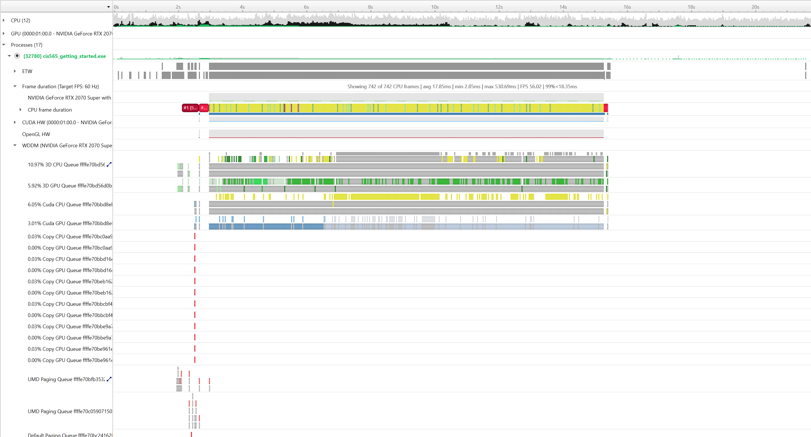
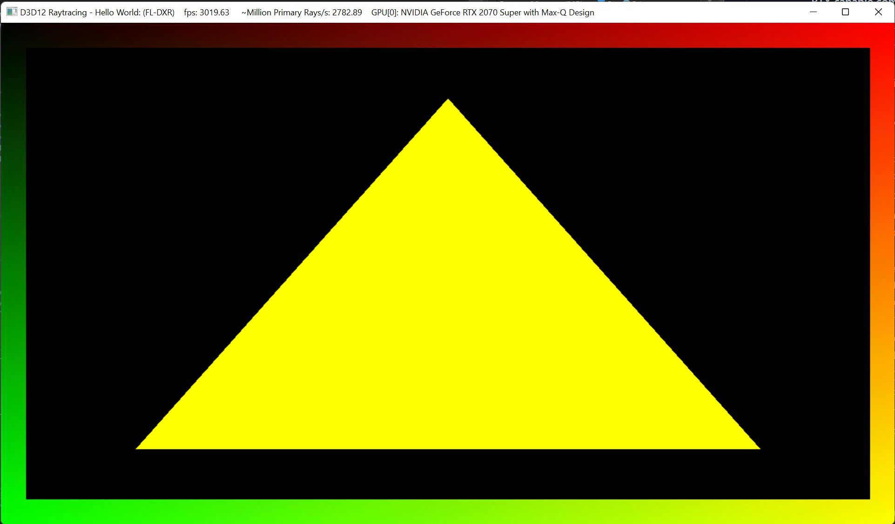
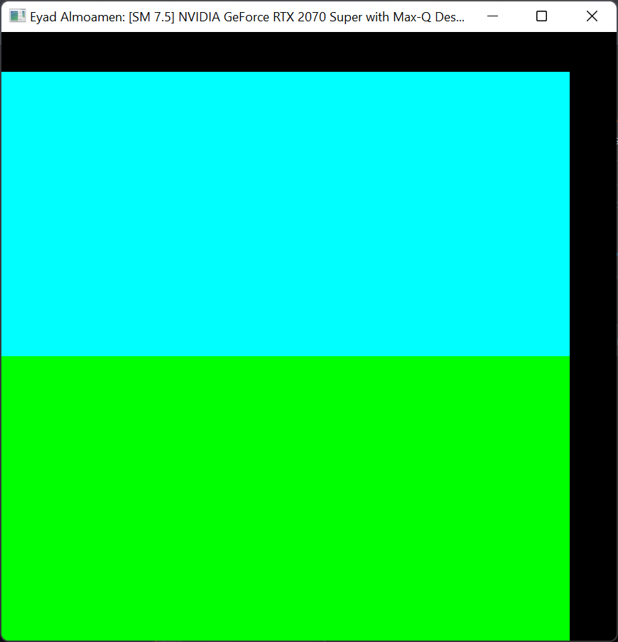
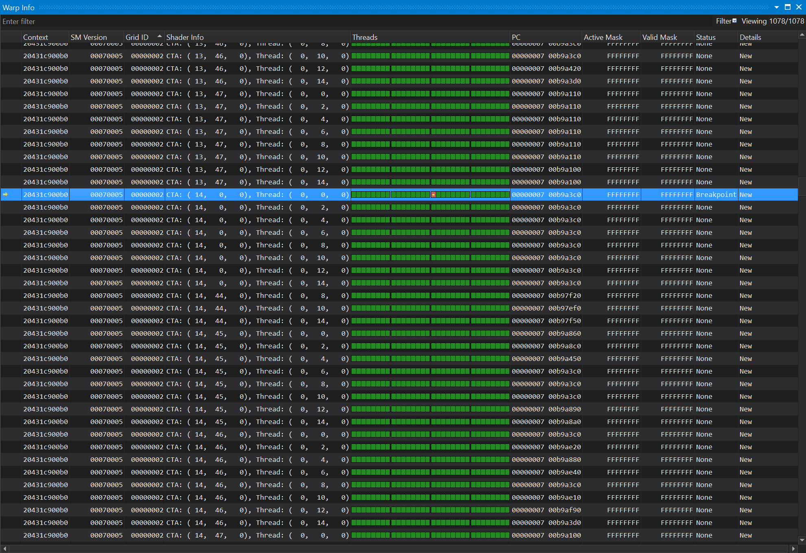
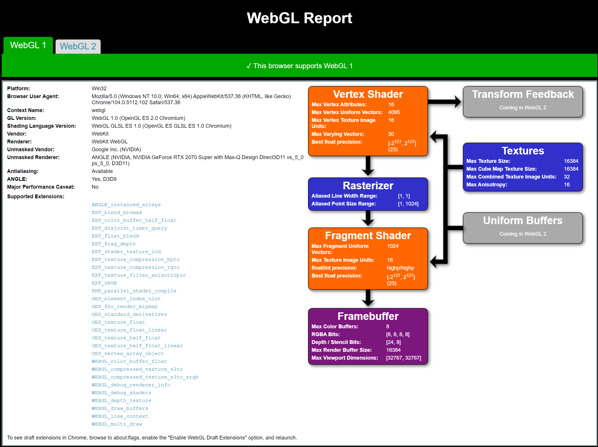
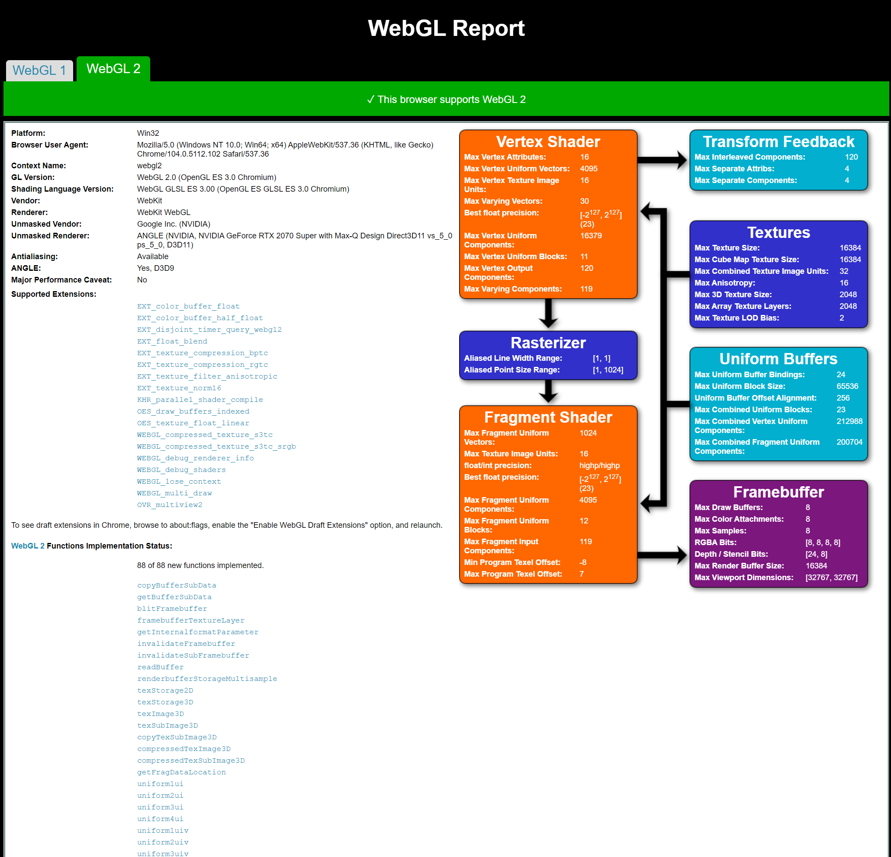

Project 0 Getting Started
====================

**University of Pennsylvania, CIS 565: GPU Programming and Architecture, Project 0**

* Eyad Almoamen
  * [LinkedIn](https://www.linkedin.com/in/eyadalmoamen/), [personal website](https://eyadnabeel.com)
* Tested on: Windows 11, i7-10750H CPU @ 2.60GHz 2.59 GHz 16GB, RTX 2070 Super Max-Q Design 6GB (Personal Computer)

Include screenshots, analysis, etc. (Remember, this is public, so don't put
anything here that you don't want to share with the world.)

