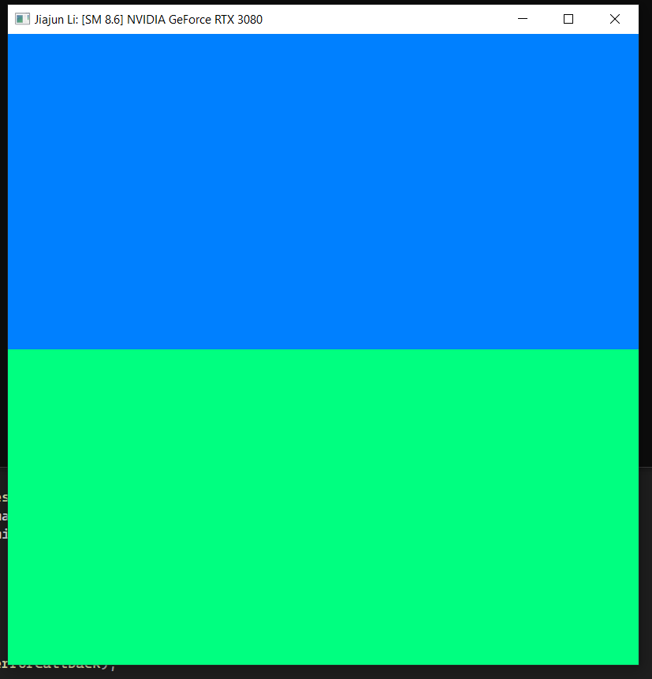
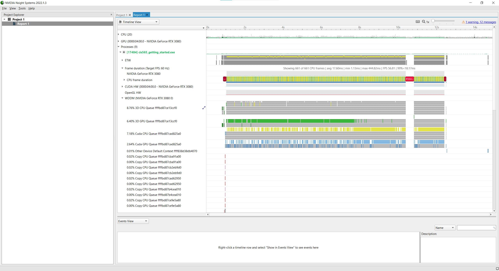
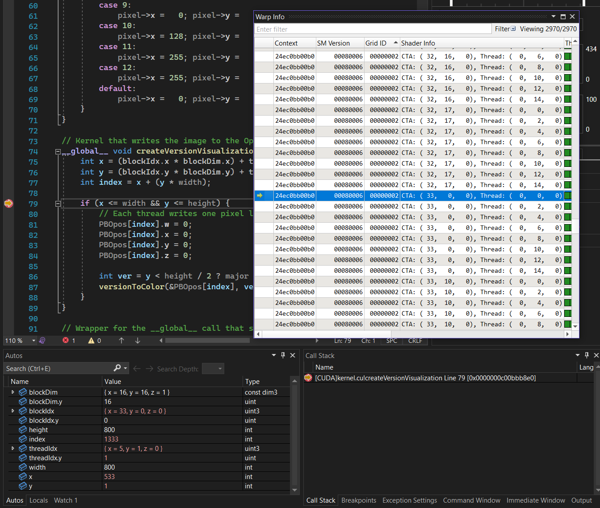
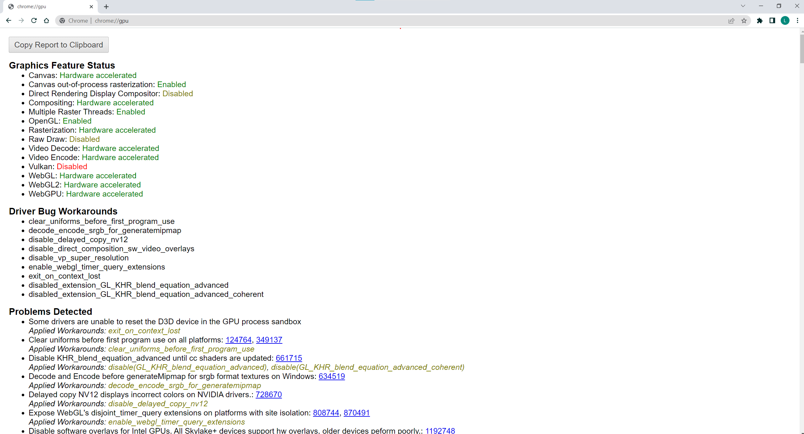
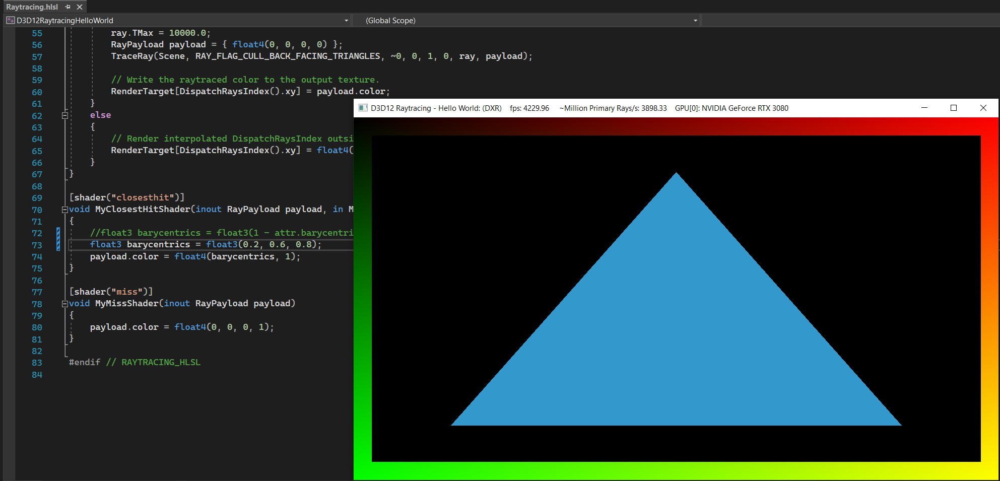

Project 0 Getting Started
====================

**University of Pennsylvania, CIS 565: GPU Programming and Architecture, Project 0**

Jiajun Li

Linkedin: https://www.linkedin.com/in/jiajun-li-5063a4217/

Tested on: Windows 10, i7-12700 @ 2.10GHz, 32GB, RTX3080 12GB

CUDA Compute Capability: 8.6

1. Cuda project output with title modification:

    

2. Nsight debug:

    

3. Break point debug:

    

4. WebGL support:

    

5. DXR triangle:

    

