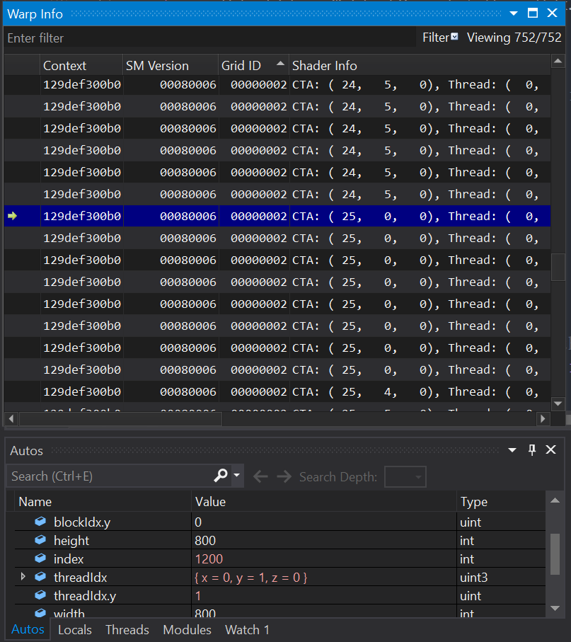
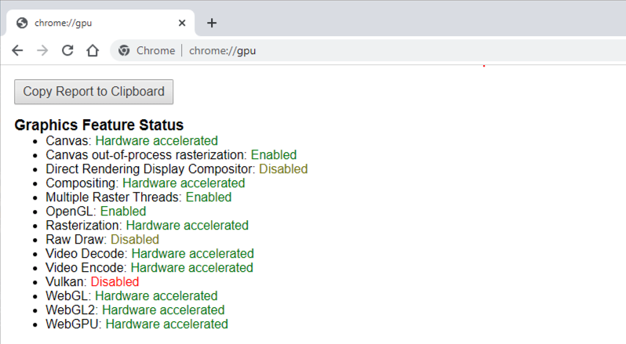
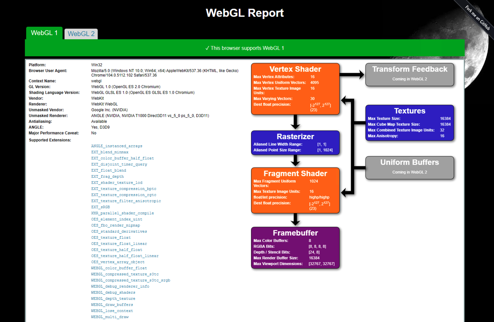

Project 0 Getting Started
====================

**University of Pennsylvania, CIS 565: GPU Programming and Architecture, Project 0**

* Ginny (Shiting) Xiao
  *  [LinkedIn](https://www.linkedin.com/in/ginnyxiao/)
* Tested on: (CETS Virtual Lab) Windows 10, i7-12700 @ 2.10 GHz 32GB, NVIDIA T1000 20190MB 

### README

#### Part 3.1.1

#### Part 3.1.3

#### Part 3.2

#### Part 3.3

CETS has not installed the required Windows SDK to be able to run the DXR project.
