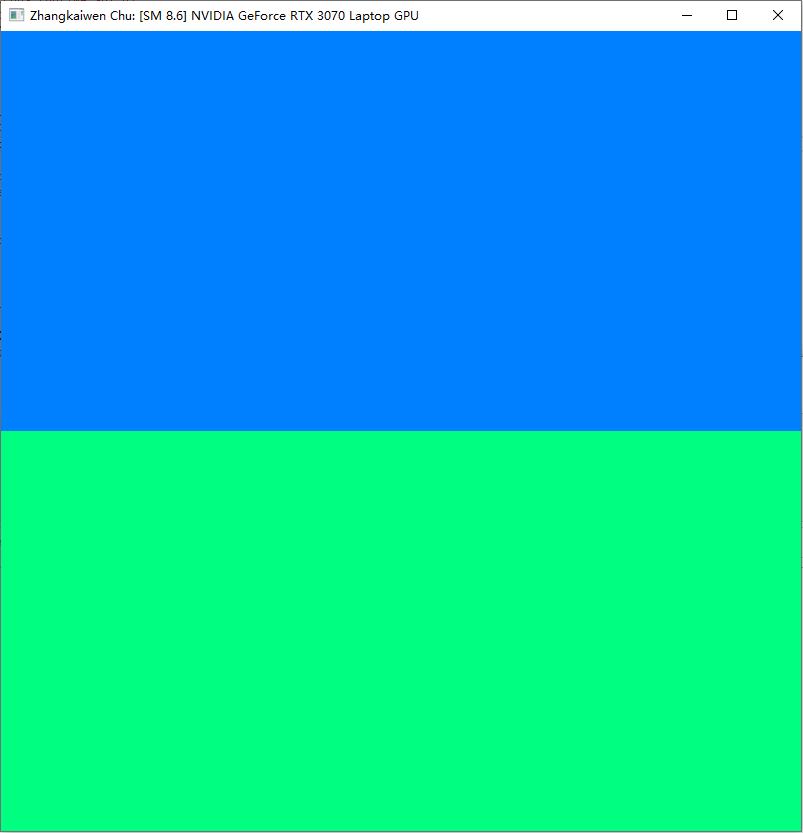
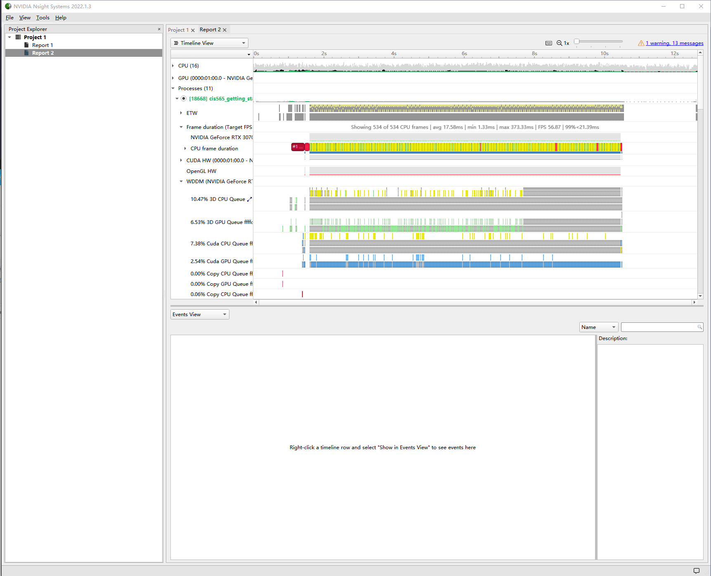
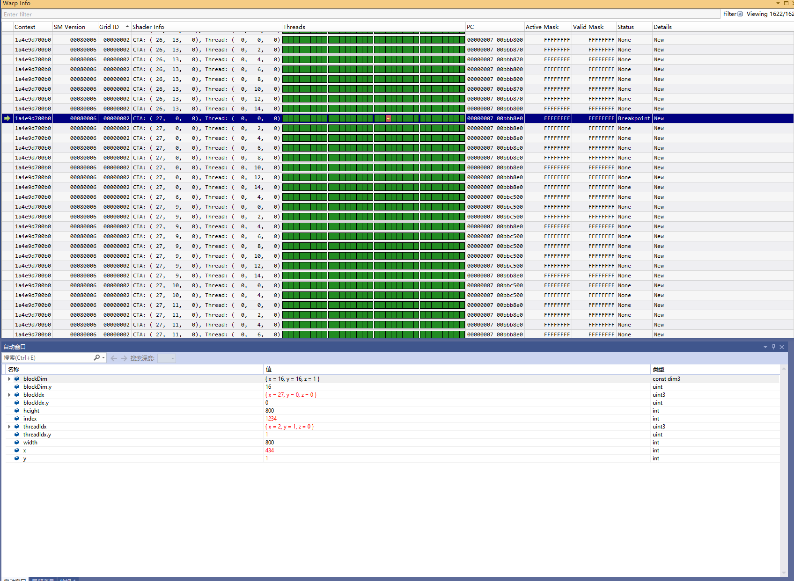
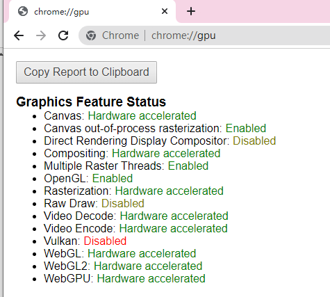
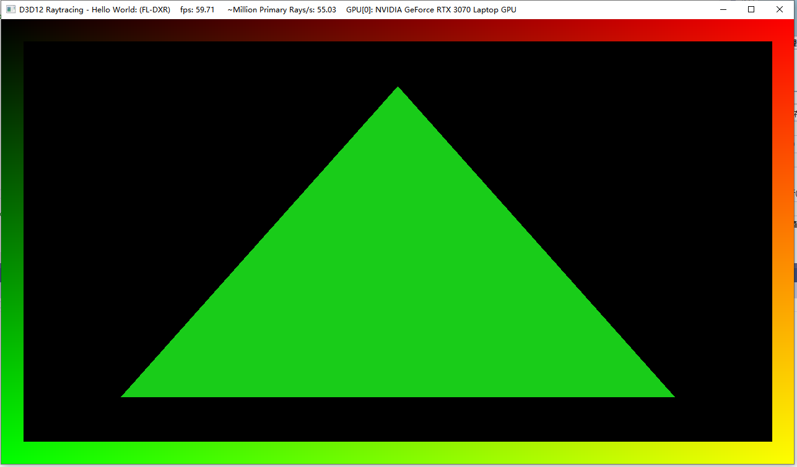

Project 0 Getting Started
====================

**University of Pennsylvania, CIS 565: GPU Programming and Architecture, Project 0**

* Zhangkaiwen Chu
  * [LinkedIn](https://www.linkedin.com/in/zhangkaiwen-chu-b53060225/)
* Tested on: Windows 10, R7-5800H @ 3.20GHz 16GB, RTX 3070 Laptop GPU 16310MB (Personal Laptop)

Results
====================

### Part 3.1.1: Modify the CUDA Project and Take a Screenshot

### Part 3.1.2: Analyze

### Part 3.1.3: Nsight Debugging

### Part 3.2: WebGL

### Part 3.3: DXR

The color is (0.1, 0.8, 0.1).

