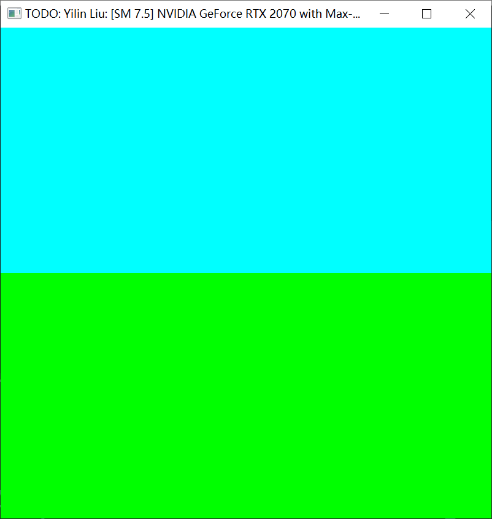
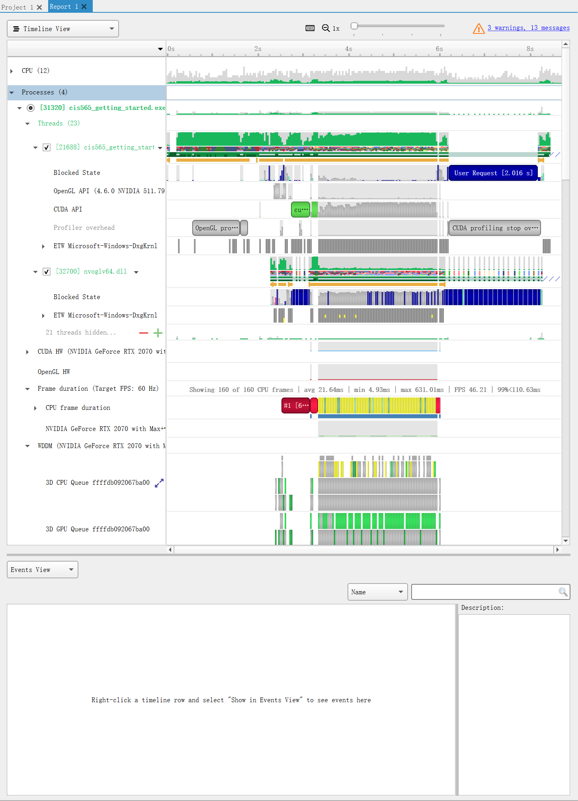
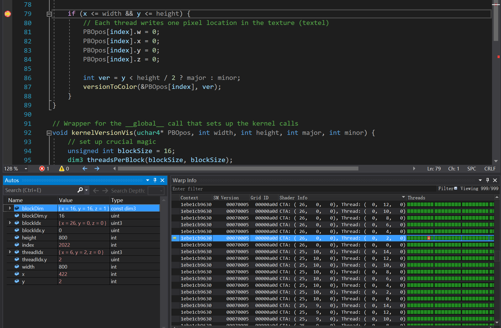
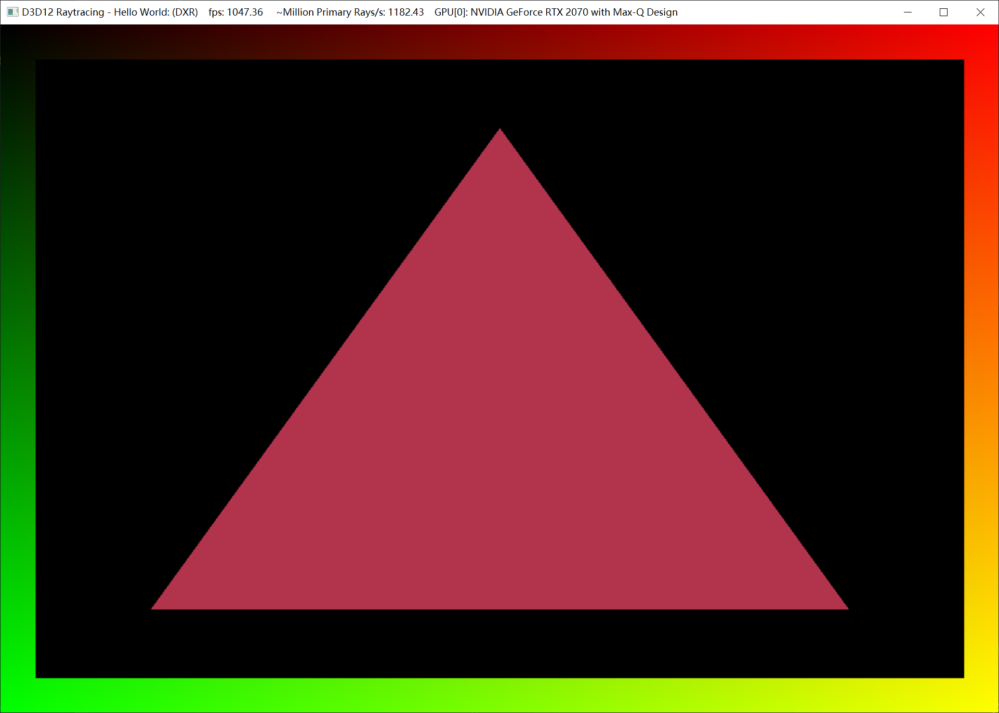
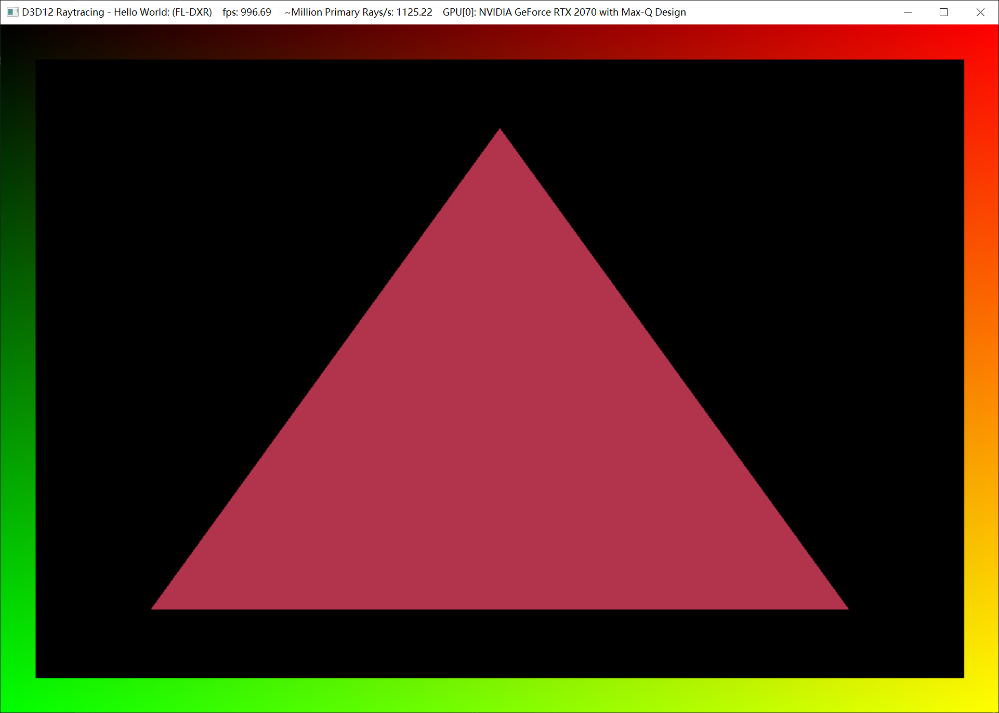

Project 0 Getting Started
====================

**University of Pennsylvania, CIS 565: GPU Programming and Architecture, Project 0**

* Yilin Liu
  * [LinkedIn](https://www.linkedin.com/in/yilin-liu-9538ba1a5/), [Personal Website](https://yilin.games/)
* Tested on: Windows 10, i7-10750H @ 2.59GHz 32GB, GeForce RTX 2070 with Max-Q 8192MB (Personal Laptop) 

### Project 0 Results

#### 1. CUDA Capability 7.5

#### 2. NVIDIA NSight System Analysis

#### 3. NVIDIA NSight Debugger

#### 4. WebGL Report

#### 5. DXR

#### 6. FL-DXR

The machine only supports FL-DXR and DXR. 
