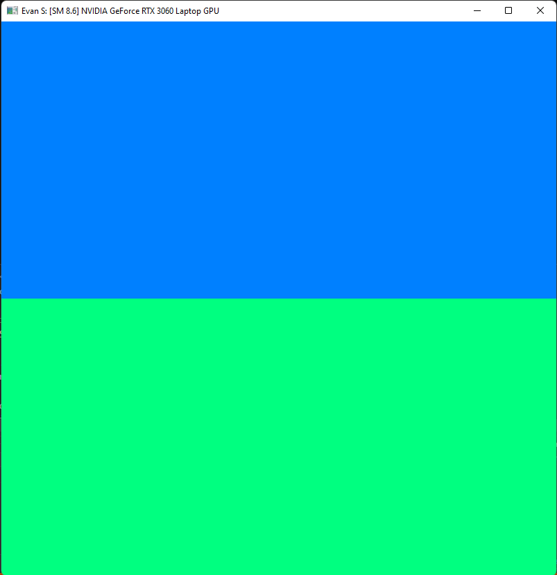
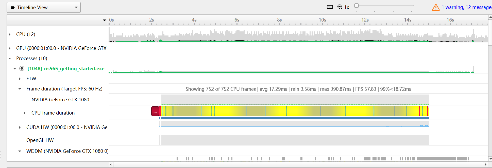
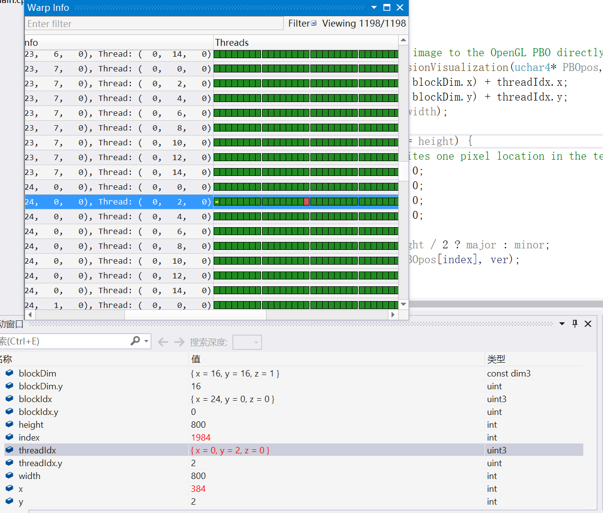
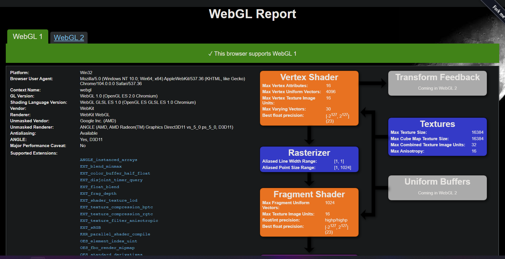
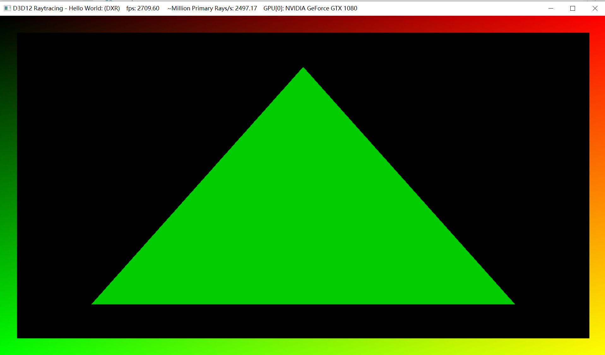

Project 0 Getting Started
====================

**University of Pennsylvania, CIS 565: GPU Programming and Architecture, Project 0**

* Evan S (anthias)
* Tested on: Personal device: Windows 11, Ryzen 5800HS @ 3.20GHz, RTX 3060 Notebook

# Screenshots
## Part 3.1.1 Modify the CUDA Project

## Part 3.1.2. Analyze

## Part 3.1.3 NSight Debugging

## Part 3.2 WebGL Compatibility

## Part 3.3 DXR Support

(FL-DXR, DXR, FL all supported).  
The DXR program only runs successfully if suppressing the false positive for hybrid graphics systems from [here](https://stackoverflow.com/questions/69805245/directx-12-application-is-crashing-in-windows-11).  
I added the diffs from the [commit](https://github.com/walbourn/directx-vs-templates/commit/2b34dcf9ac764153699058cdc9d4dbc4e837224c) listed in the above link.

RTX 3060 (Notebook) Compute Capability: 8.6