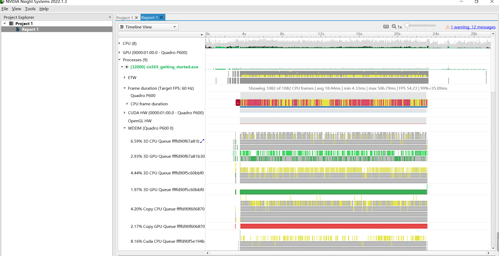
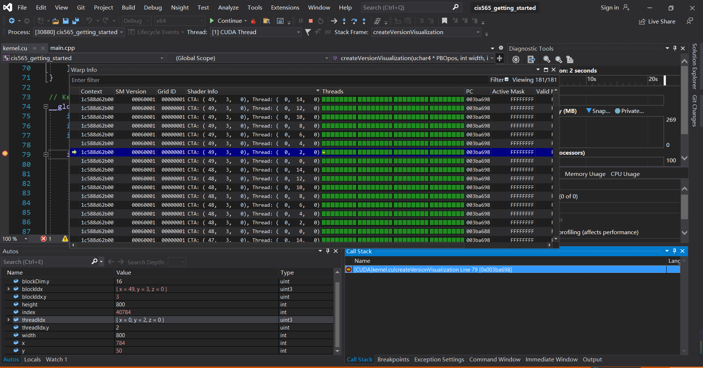
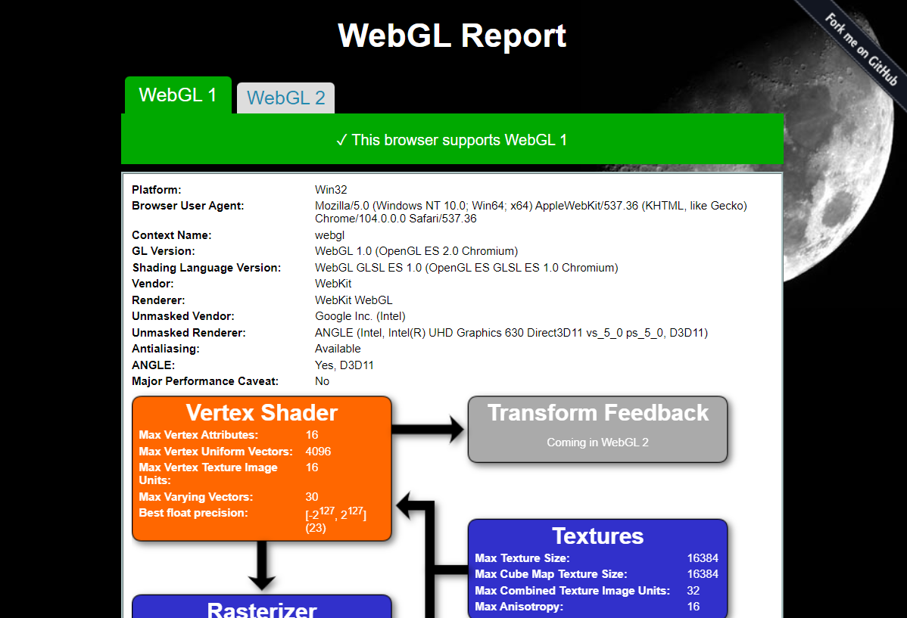
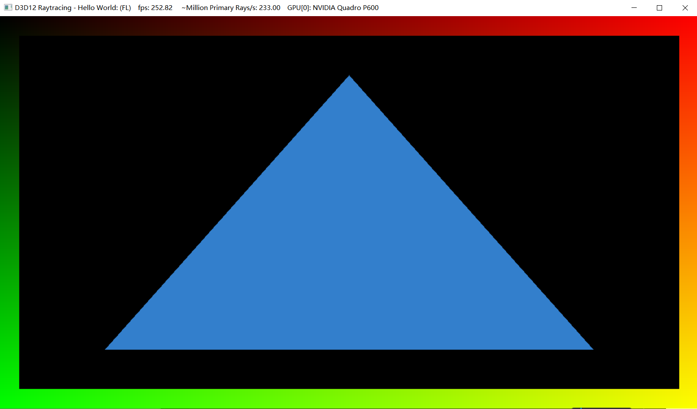

Project 0 Getting Started
====================

**University of Pennsylvania, CIS 565: GPU Programming and Architecture, Project 0**

* Jingyi Li
  * [LinkedIn](https://www.linkedin.com/feed/), etc.
* Tested on: Windows 10, i5-8300H @ 2.30GHz 16GB, Quadro P600 4026MB (personal computer)

### (TODO: Your README)

Include screenshots, analysis, etc. (Remember, this is public, so don't put
anything here that you don't want to share with the world.)

