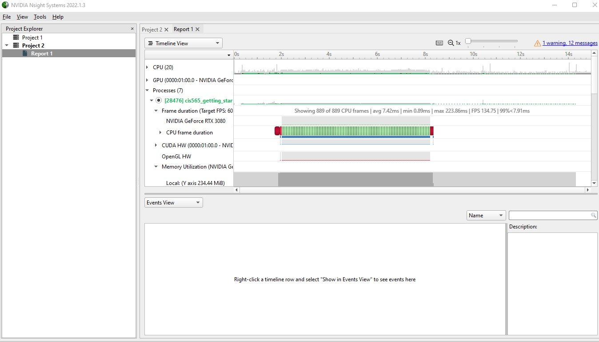
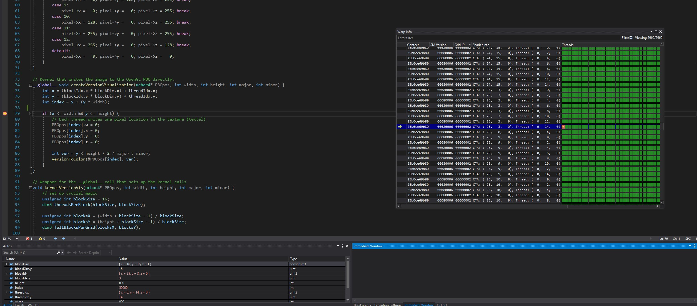
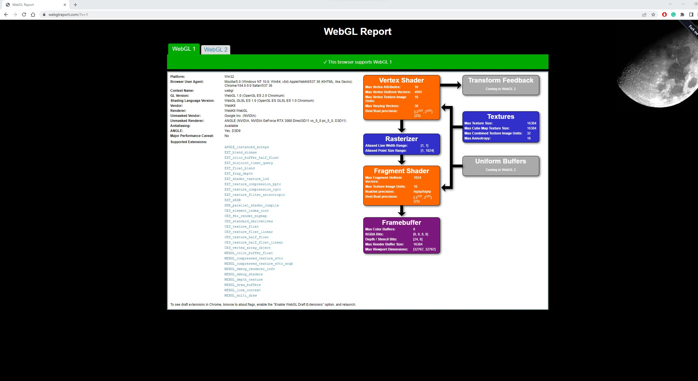
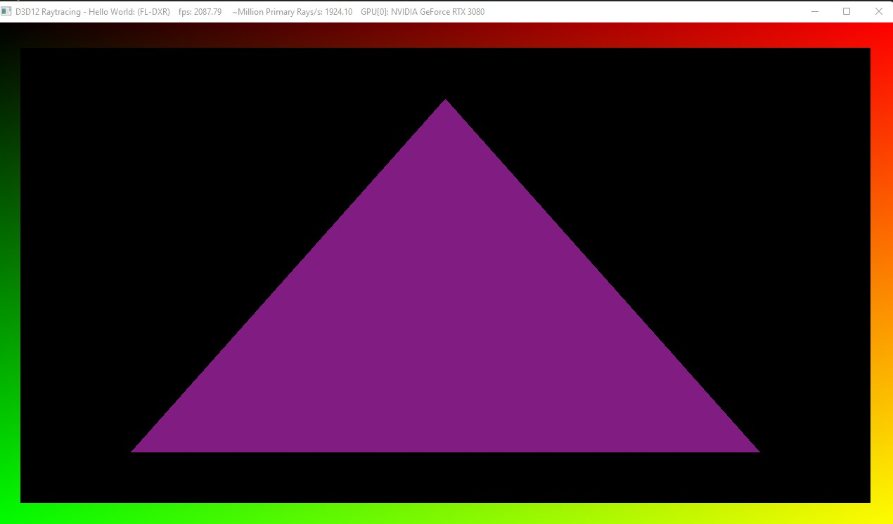

Project 0 Getting Started
====================

**University of Pennsylvania, CIS 565: GPU Programming and Architecture, Project 0**

* Guanlin Huang
  * [LinkedIn](https://www.linkedin.com/in/guanlin-huang-4406668502/), [personal website](virulentkid.github.io/personal_web/index.html)
* Tested on: Windows 11, i9-10900K @ 4.9GHz 32GB, RTX3080 10GB; Compute Capability: 8.6

### (TODO: Your README)

# Screenshots
## Part 3.1.1 Modify the CUDA Project

## Part 3.1.2. Analyze

## Part 3.1.3 NSight Debugging

## Part 3.2 WebGL Compatibility

## Part 3.3 DXR Support

