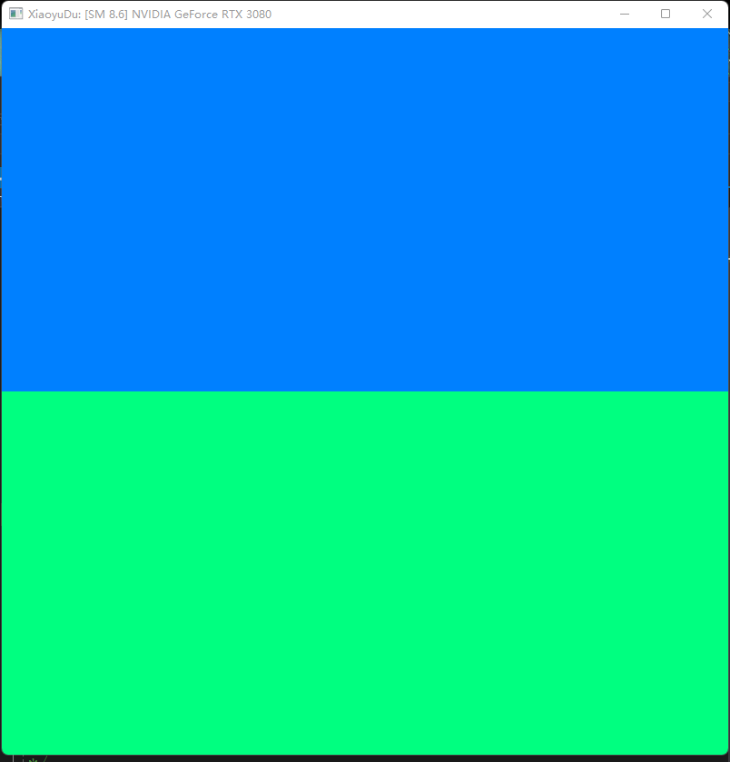
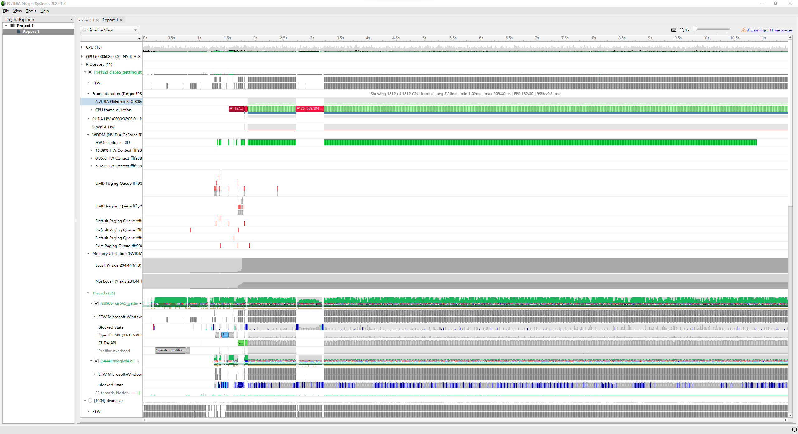
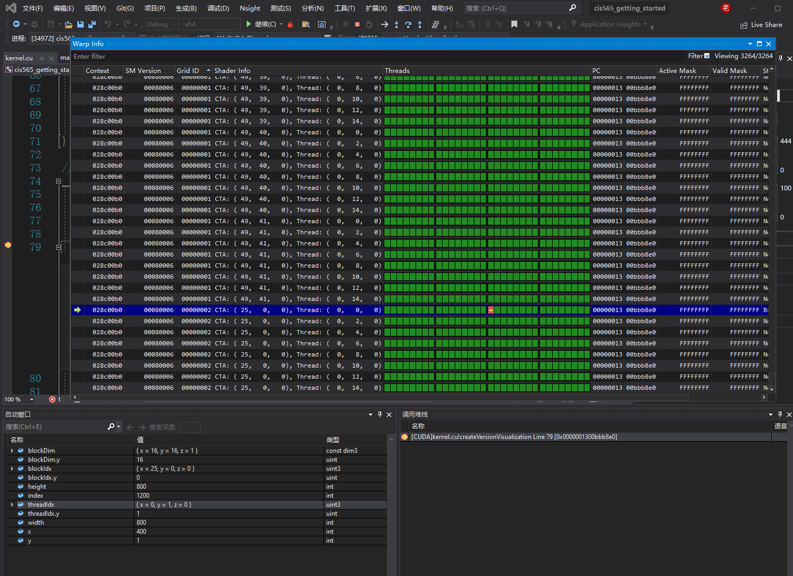
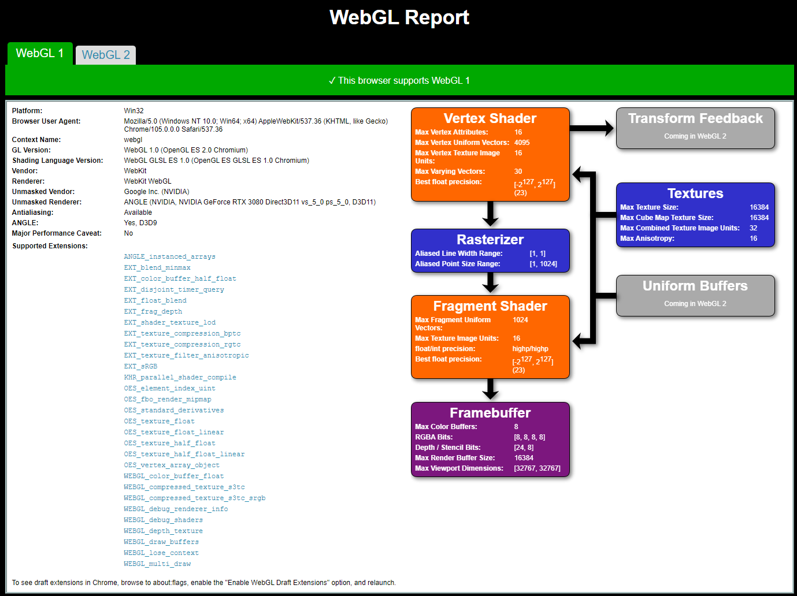
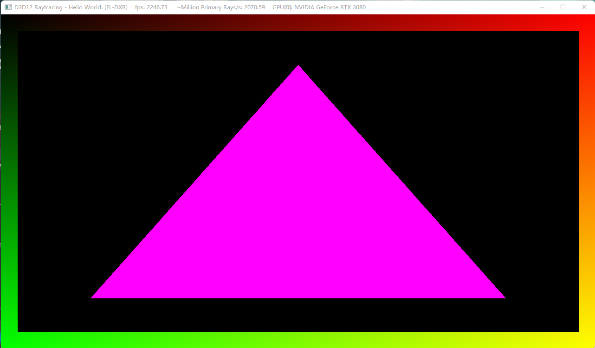

Project 0 Getting Started
====================

**University of Pennsylvania, CIS 565: GPU Programming and Architecture, Project 0**
  
XiaoyuDu  
LinkedIn: https://www.linkedin.com/in/xiaoyu-du-67261915b/
test running on Personal PC
  
  
GPU Compute Capability：GeForce RTX 3080  8.6  
  
Part 3.1.1:  
  
  
Part 3.1.2:  
  
  
Part 3.1.3:  
  
  
Part 3.2:  
  
  
Part 3.3:  
  