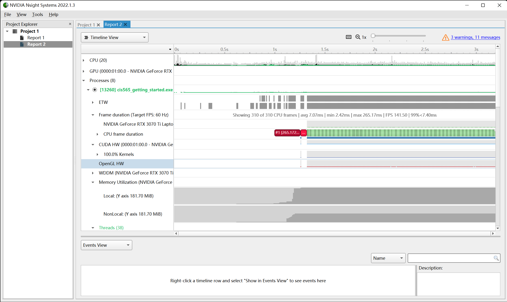
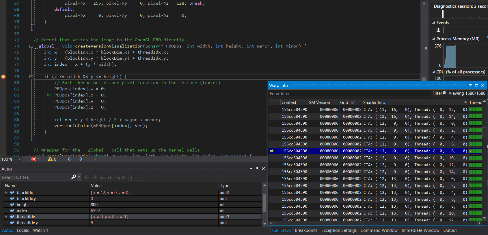
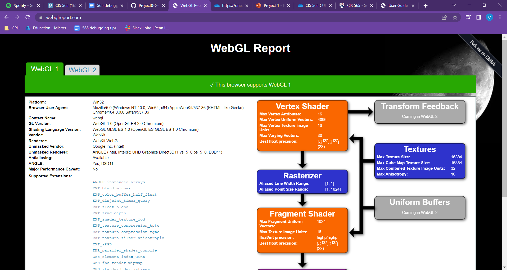
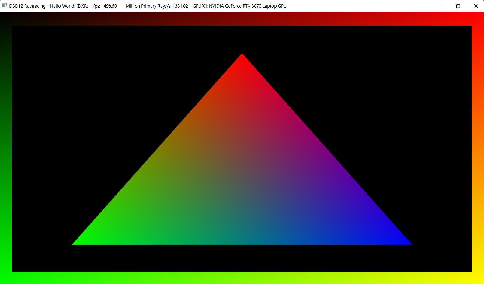
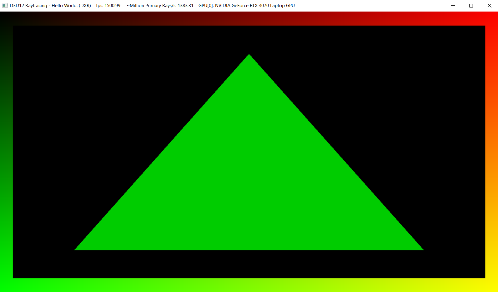

Project 0 Getting Started
====================

**University of Pennsylvania, CIS 565: GPU Programming and Architecture, Project 0**

* Constance Wang
  * [LinkedIn](https://www.linkedin.com/in/conswang/)
* Tested on AORUS 15P XD laptop with specs:
  * Windows 11 22000.856
  * 11th Gen Intel(R) Core(TM) i7-11800H @ 2.30GHz   2.30 GHz
  * NVIDIA GeForce RTX 3070 Laptop GPU

### Screenshots

Cuda window screenshot  

Nsight profiling  

Autos and warp info  

Webgl supported  

Dxr supported  

Fallback Dxr supported  

Edit triangle color working  

