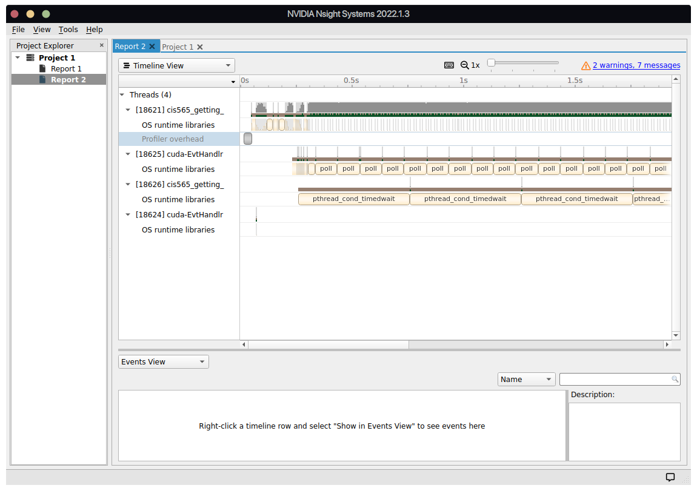
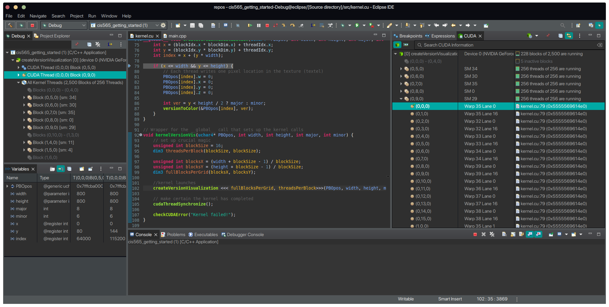
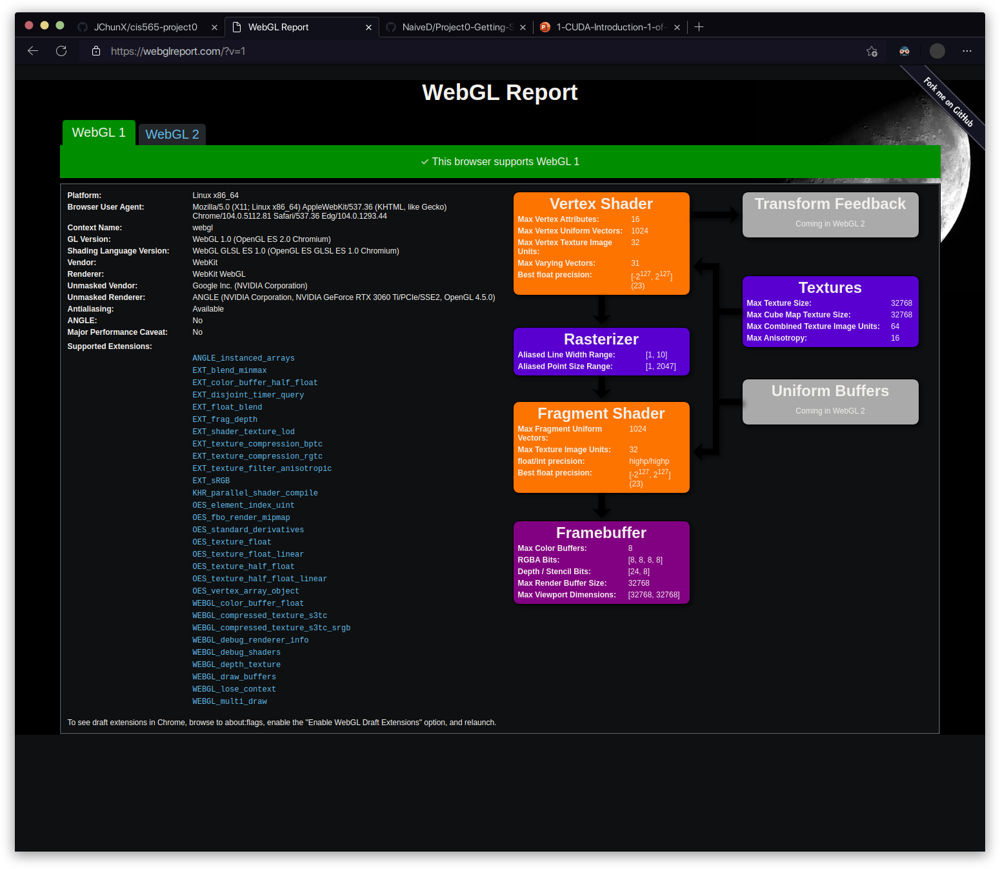

Project 0 Getting Started
====================

**University of Pennsylvania, CIS 565: GPU Programming and Architecture, Project 0**

* Name: Jason Xie
  * [LinkedIn](https://www.linkedin.com/in/jia-chun-xie/)
  * [Personal Website](jchunx.github.io)
* Tested on: Ubuntu 20.04, Intel i5-8400 @ 2.80GHz, 16GB RAM, GeForce RTX 3060Ti (Personal Computer)

### Part 3.1: CUDA

GPU Compute Capability: 8.6

#### Part 3.1.1: Modify the CUDA Project and Take a Screenshot

#### Part 3.1.2: Analyze

#### Part 3.1.3: Nsight Debugging

### Part 3.2: WebGL

### Part 3.3: DXR

*** Note: My current Linux development environment is not compatible with DXR. I am working towards acquiring the necessary tools on my Windows partition to complete this part of the assignment.