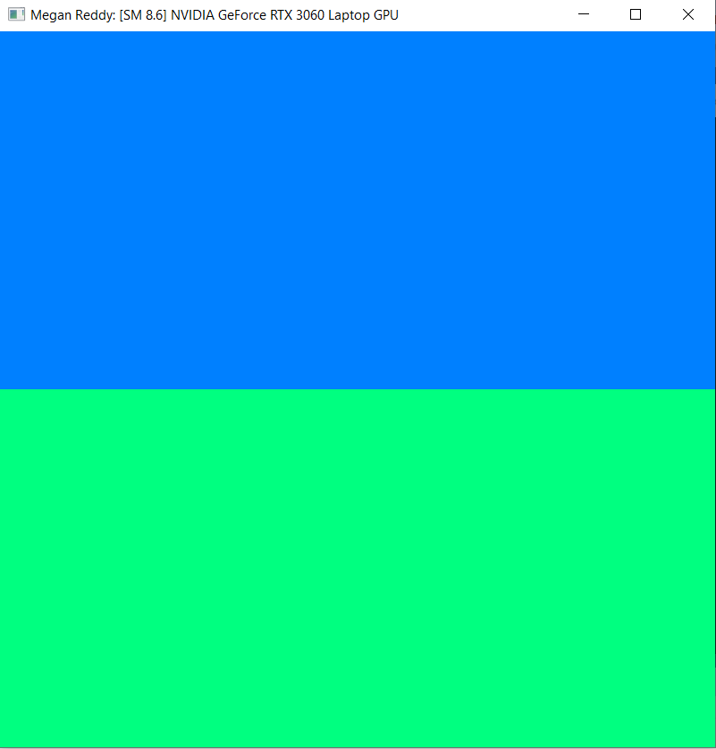
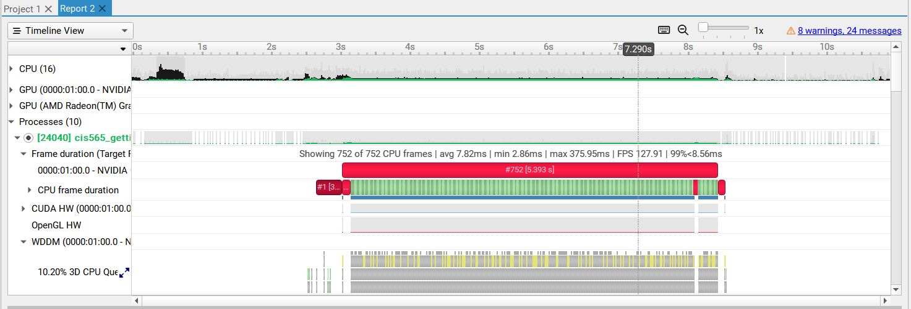
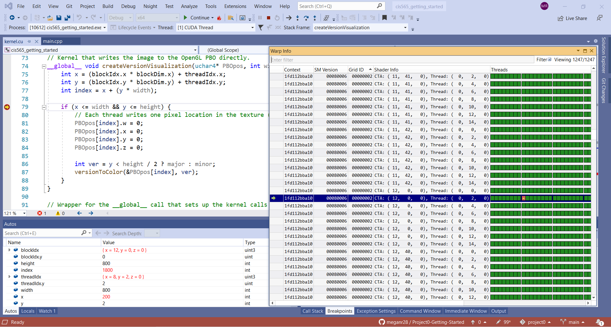
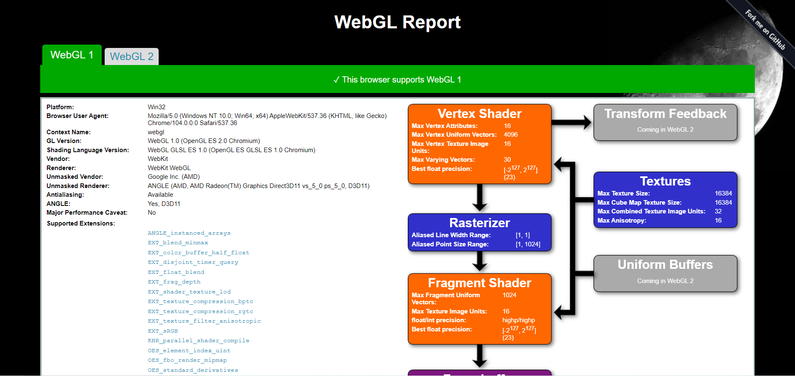
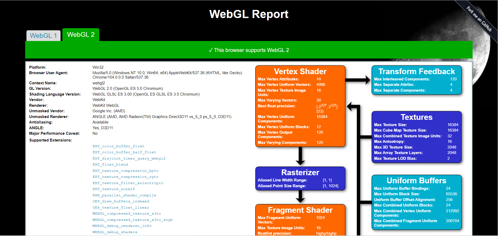
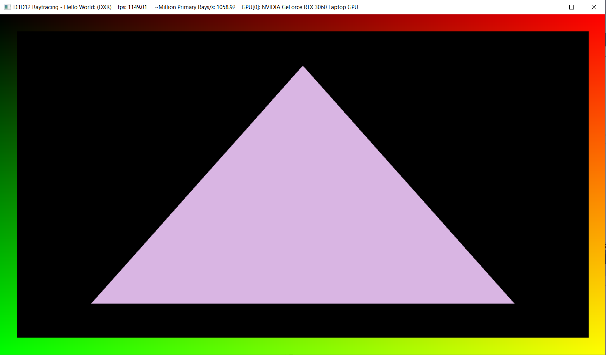

Project 0 Getting Started
====================

**University of Pennsylvania, CIS 565: GPU Programming and Architecture, Project 0**

* Megan Reddy
  * [LinkedIn](https://www.linkedin.com/in/meganr25a949125/), [personal website](https://meganr28.github.io/)
* Tested on: Windows 10, AMD Ryzen 9 5900HS with Radeon Graphics @ 3301 MHz 16GB, NVIDIA GeForce RTX 3060 Laptop GPU 6GB (Personal Computer)
* Compute Capability: 8.6

### Project Writeup

#### 3.1.1. Name in Title Bar

#### 3.1.2. Timeline

#### 3.1.3. Nsight Debugging

#### 3.2. WebGL Compatibility

#### 3.3. DXR Triangle

