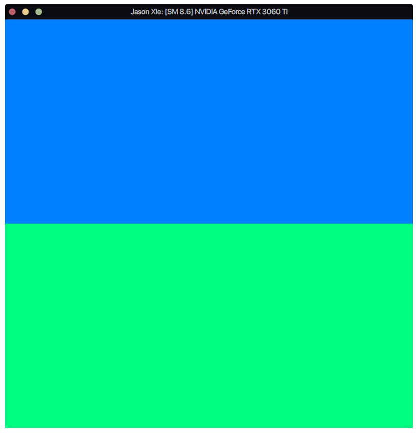

Project 0 Getting Started
====================

**University of Pennsylvania, CIS 565: GPU Programming and Architecture, Project 0**

* Name: Jason Xie
  * [LinkedIn](https://www.linkedin.com/in/jia-chun-xie/)
  * [Personal Website](jchunx.github.io)
* Tested on: Ubuntu 20.04, i5-8400 @ 2.80GHz 16GB, RTX 3060Ti

### Part 3.1: CUDA

GPU Compute Capability: 8.6

#### Part 3.1.1: Modify the CUDA Project and Take a Screenshot

