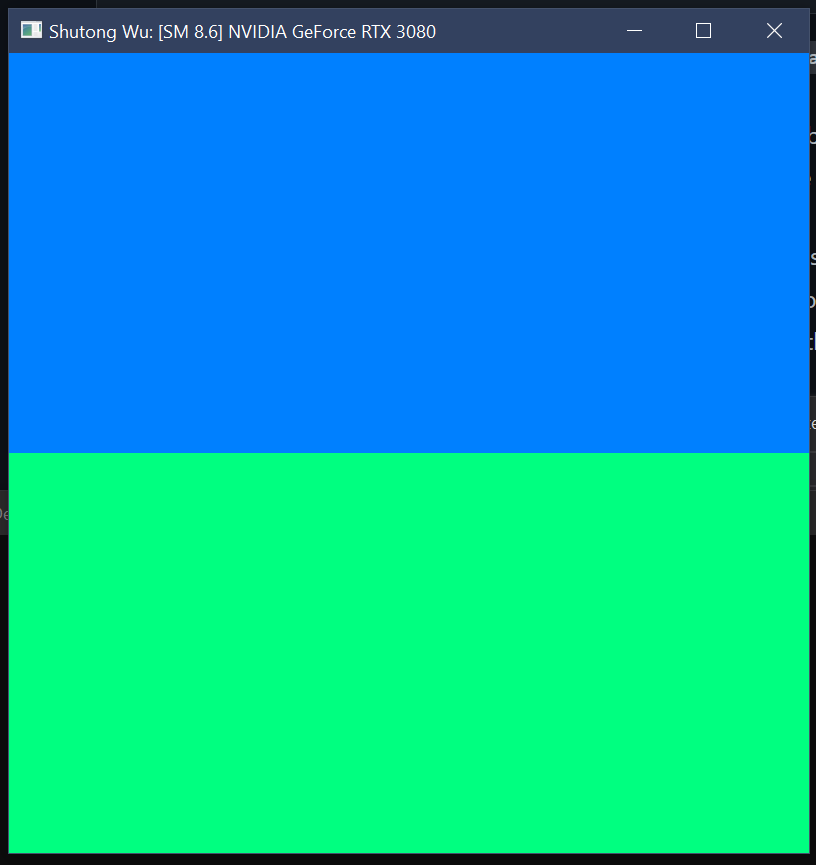
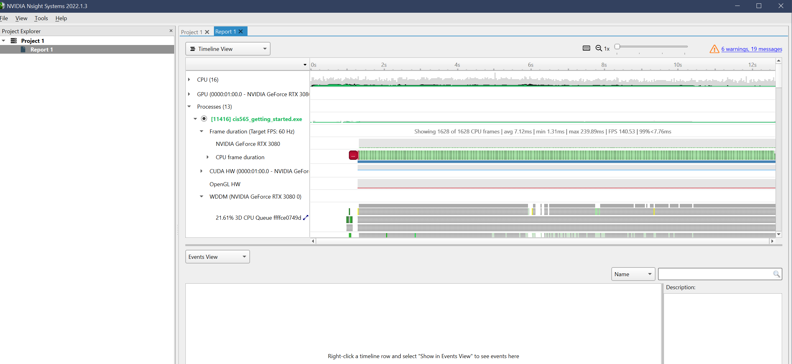
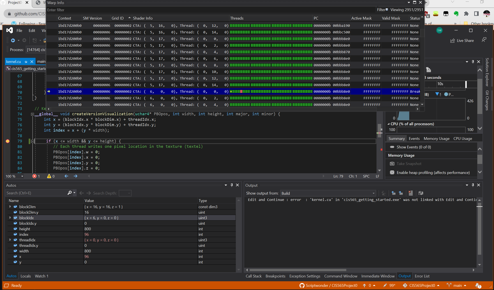
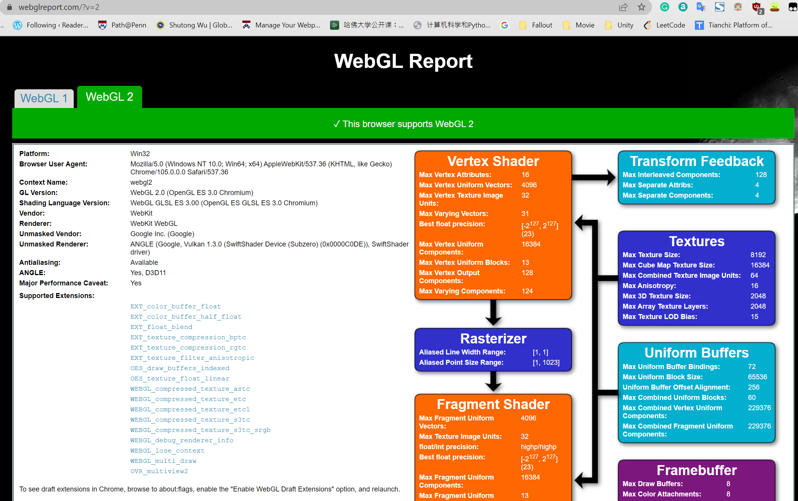
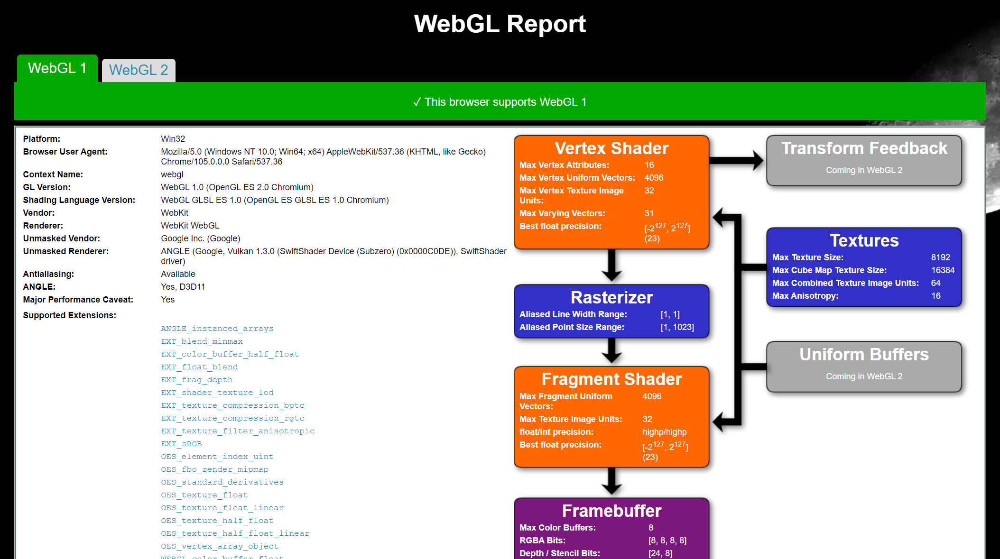
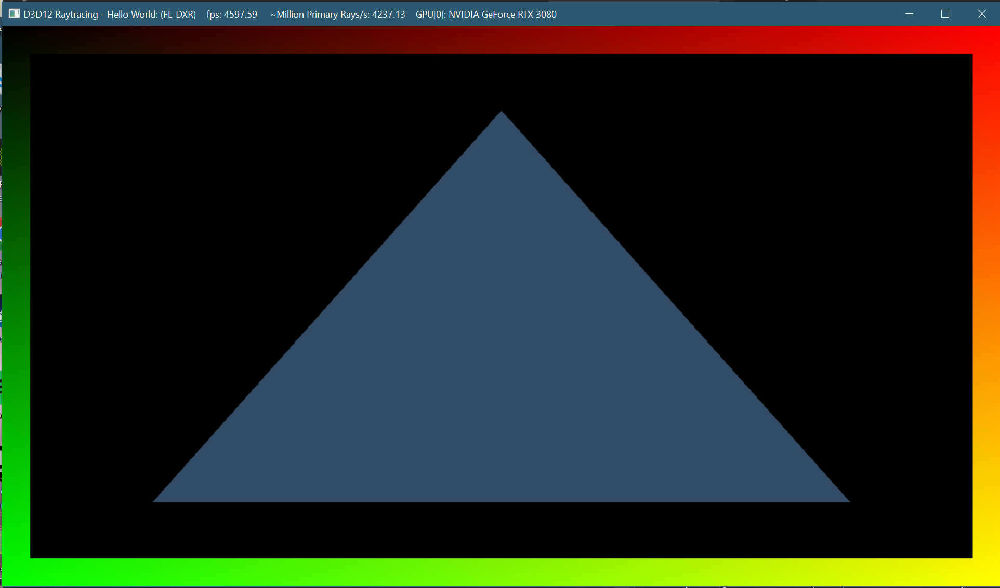

Project 0 Getting Started
====================

**University of Pennsylvania, CIS 565: GPU Programming and Architecture, Project 0**

* Shutong Wu 
  * LinkedIn: https://www.linkedin.com/in/shutong-wu-214043172/ 
* Tested on: Windows 10, i7-10700K CPU @ 3.80GHz, RTX3080, SM8.6, Personal Computer 

Screenshots: 

 

 

 

 

 

 
