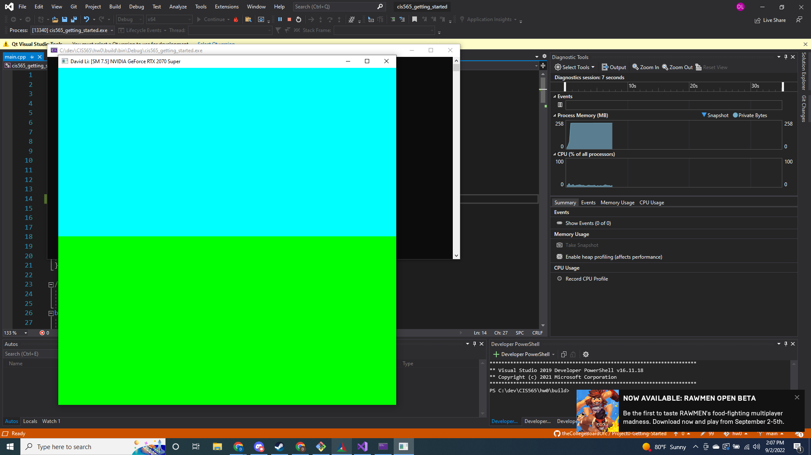
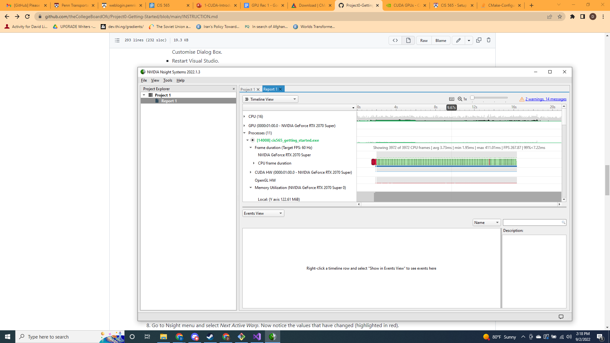
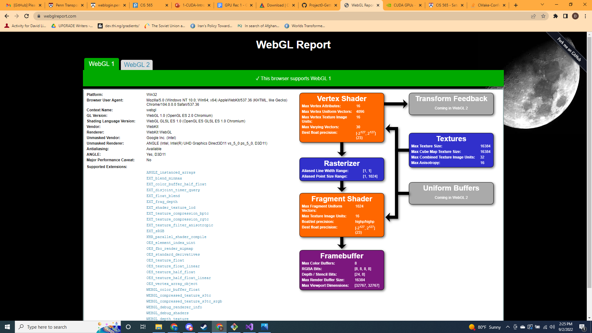
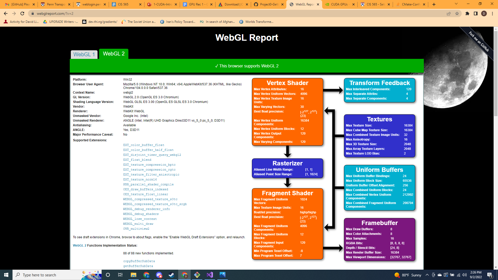
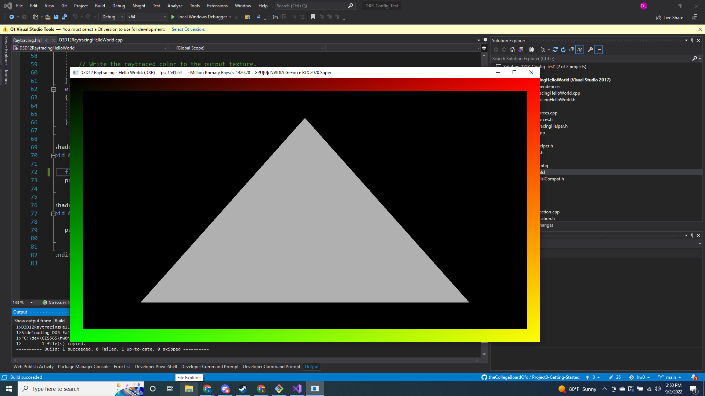

Project 0 Getting Started
====================

**University of Pennsylvania, CIS 565: GPU Programming and Architecture, Project 0**

* David Li
* [LinkedIn](https://www.linkedin.com/in/david-li-15b83817b/)
* Tested on: (TODO) Windows 10, Intel(R) Core(TM) i9-10980HK CPU @ 2.40GHz 32Gb, GTX 2070 Super (Personal Computer)

GPU Capability: 7.5

