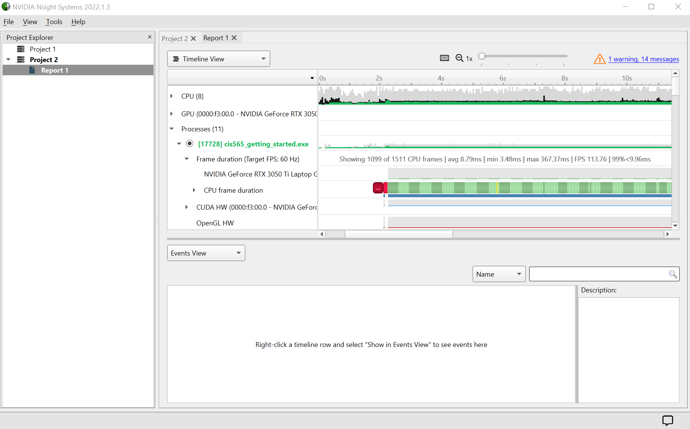
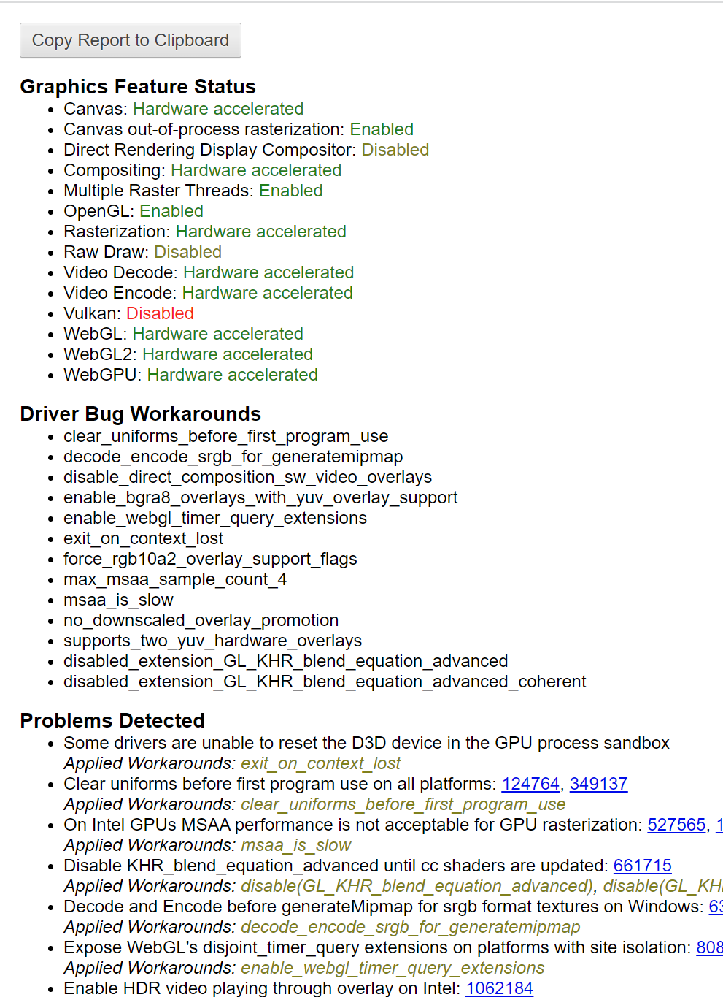

Project 0 Getting Started
====================

**University of Pennsylvania, CIS 565: GPU Programming and Architecture, Project 0**

* Dongying Liu
  * [LinkedIn](https://www.linkedin.com/in/dongying-liu/), [personal website](https://vivienliu1998.wixsite.com/portfolio)
 * Tested on: Windows 10, i9-9900K CPU @ 3.60GHz, RTX 2070 (SIGLAB)

Sorry for the late submission. I was using the virtual lab machine and stuck on part 3.1.2. I tried and setup the siglab computer later.
