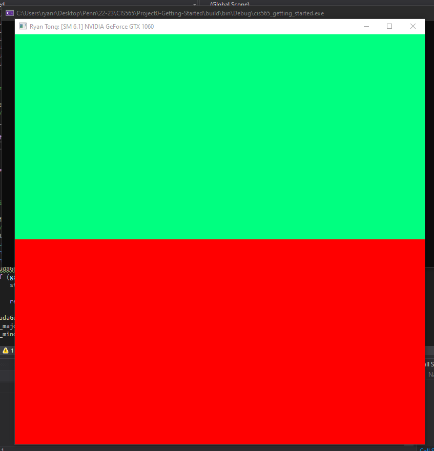
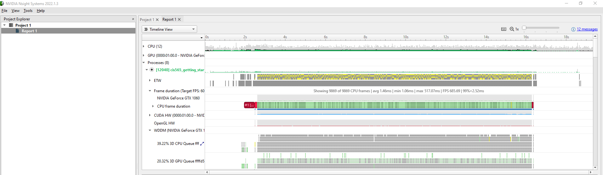
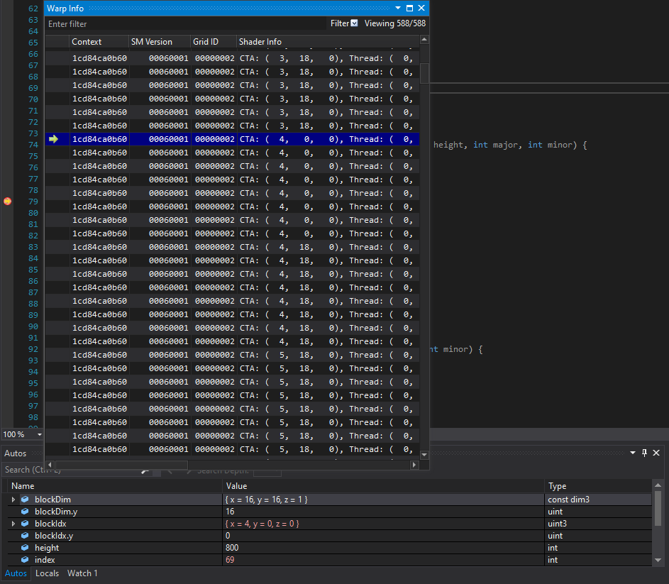
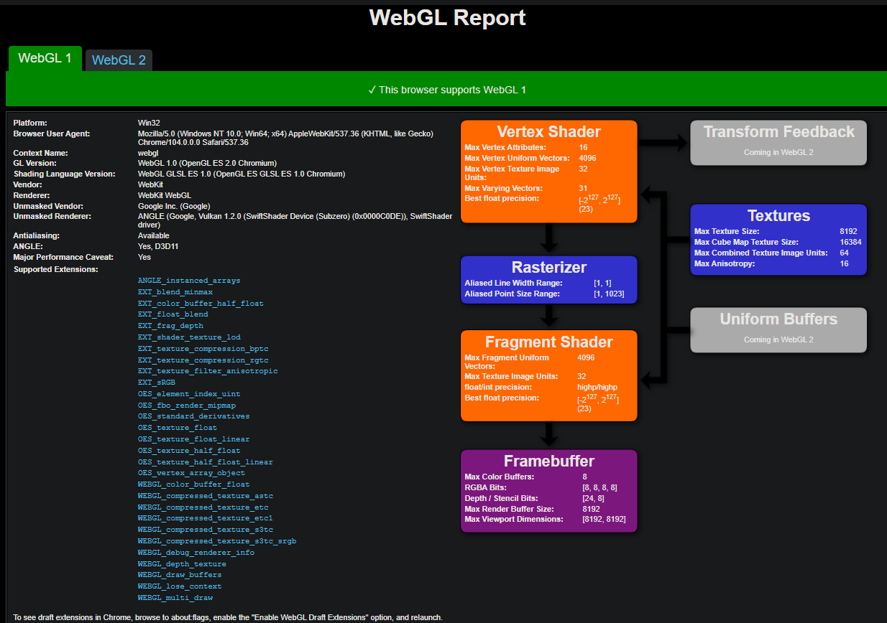
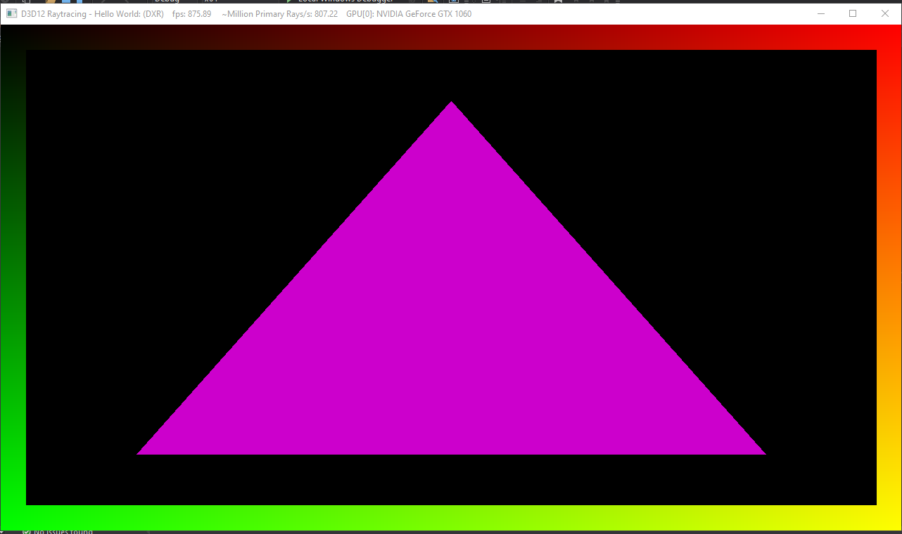

Project 0 Getting Started
====================

**University of Pennsylvania, CIS 565: GPU Programming and Architecture, Project 0**

* Ryan Tong
  * [LinkedIn](https://www.linkedin.com/in/ryanctong/), [personal website](), [twitter](), etc.
* Tested on: Windows 10, i7-8750H @ 2.20GHz 16GB, GeForce GTX 1060 6144MB (Personal Laptop)

###
Compute Capability: 6.1

Include screenshots, analysis, etc. (Remember, this is public, so don't put
anything here that you don't want to share with the world.)

