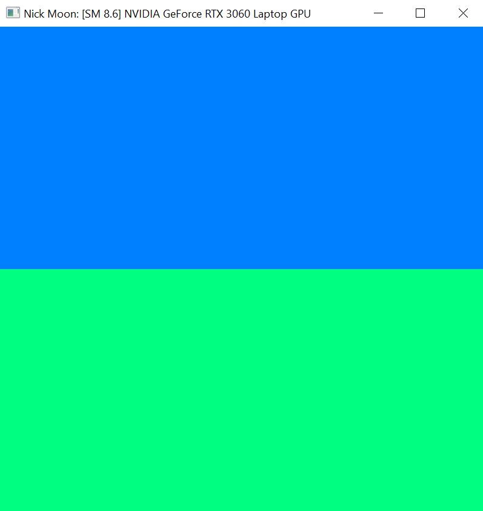
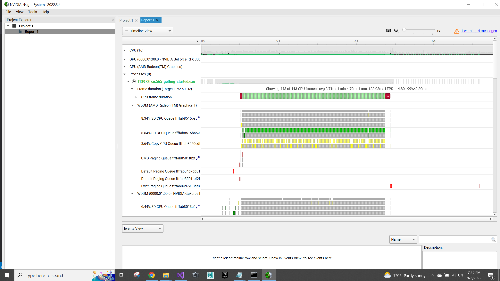
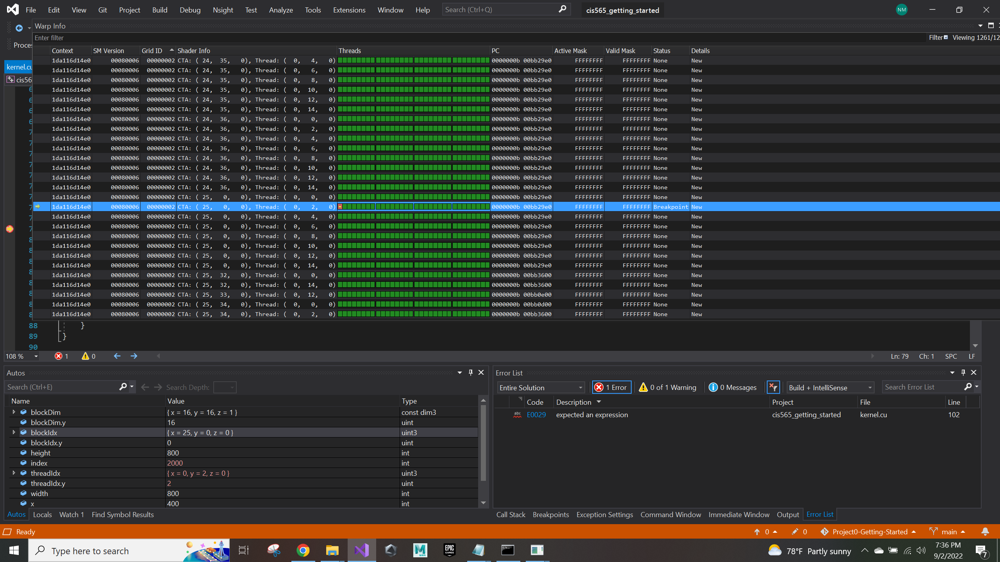
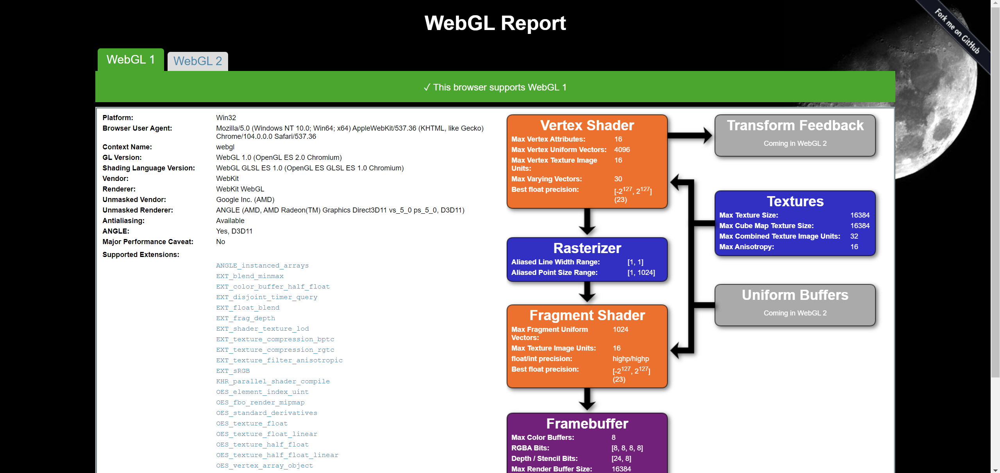
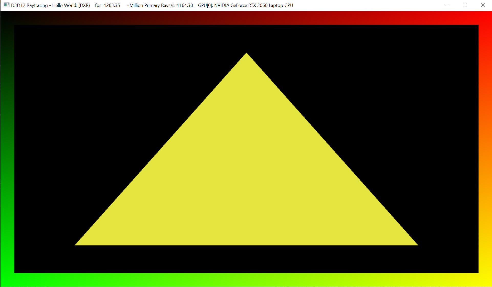

Project 0 Getting Started
====================

**University of Pennsylvania, CIS 565: GPU Programming and Architecture, Project 0**

* Nick Moon
  * [LinkedIn](https://www.linkedin.com/in/nick-moon1/), [personal website](https://nicholasmoon.github.io/)
* Tested on: Windows 10, AMD Ryzen 9 5900HS @ 3.0GHz 32GB, NVIDIA RTX 3060 Laptop 6GB (Personal Laptop)

### Results

Part 3.1.1 CUDA results:

Part 3.1.2 Nsight Profiler results:

Part 3.1.3 Nsight Debugger results:

Part 3.2 WebGL results:

Part 3.3 DXR results:

