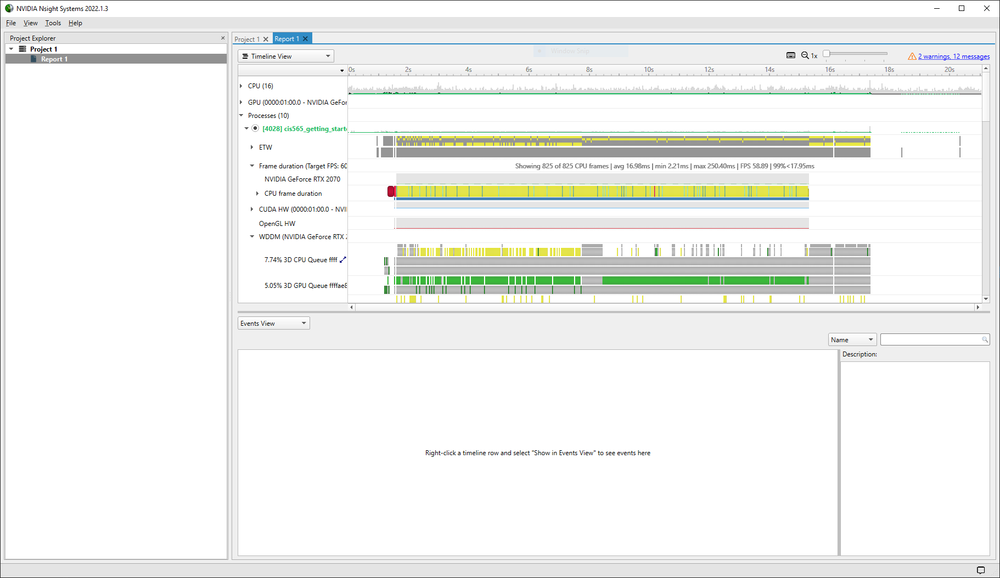

Project 0 Getting Started
====================

**University of Pennsylvania, CIS 565: GPU Programming and Architecture, Project 0**

* Zhuohao Lin
  * [LinkedIn](https://www.linkedin.com/in/zhuohao-lin-960b54194/)
* Tested on: Windows 10, i7-10875H @ 2.30GHz 16GB, NVIDIA Grforce RTX 2060 6GB (personal machine)

### Compute Capability: 7.5

## Part 3.1.1

## Part 3.1.2

## Part 3.1.3

## Part 3.2
.PNG)
.PNG)

## Part 3.3

