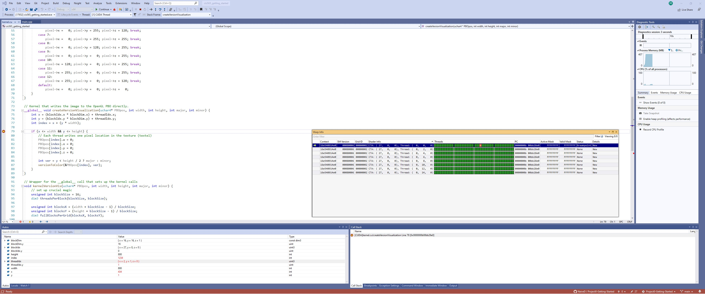
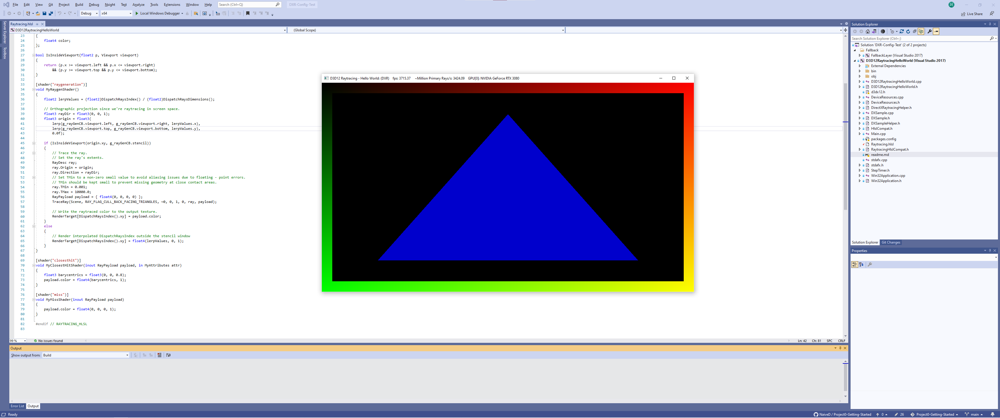

Project 0 Getting Started
====================

**University of Pennsylvania, CIS 565: GPU Programming and Architecture, Project 0**

* Haoquan Liang
  * [LinkedIn](https://www.linkedin.com/in/leohaoquanliang/)
* Tested on: Windows 10, Ryzen 7 5800X 8 Core 3.80 GHz, NVIDIA GeForce RTX 3080 Ti 12 GB

# Screenshots

## Part 3.1.2: Analyze Performance

## Part 3.1.3: NSight Debugging

## Part 3.2: WebGL Support

## Part 3.3: DXR Support
