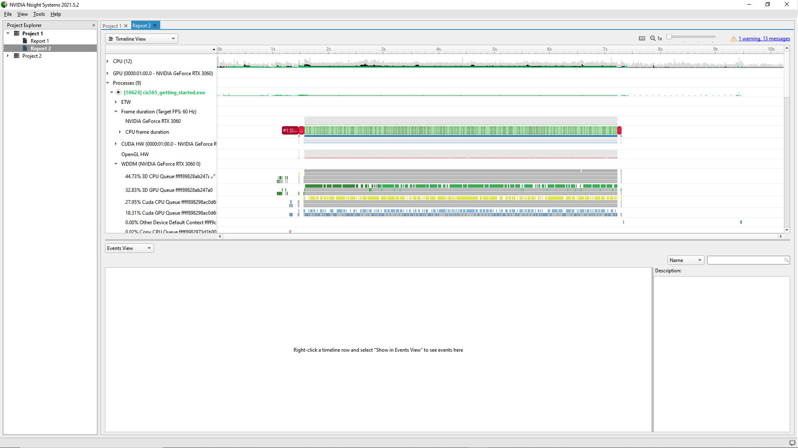
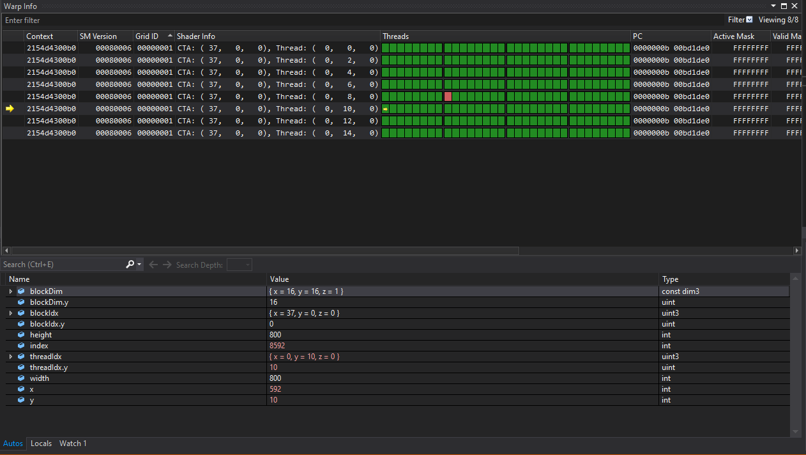

Project 0 Getting Started
====================

**University of Pennsylvania, CIS 565: GPU Programming and Architecture, Project 0**

* Tom Donnelly
  * [LinkedIn]https://www.linkedin.com/in/the-tom-donnelly/
* Tested on: Windows 11, AMD Ryzen 9 5900X, NVIDIA GeForce RTX 3070 (Personal Desktop)

### (README)
3.1
Compute Capability sm: 8.6
3.1.1

3.1.2

3.1.3

3.2

3,3

