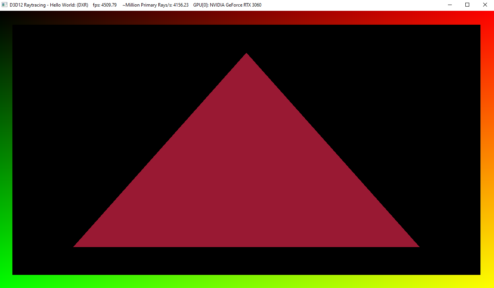

Project 0 Getting Started
====================

**University of Pennsylvania, CIS 565: GPU Programming and Architecture, Project 0**

* Yu-Chia Shen
  * [LinkedIn](https://www.linkedin.com/in/ycshen0831/)
* Tested on: Windows 10, i5-11400 @ 4.3GHz 16GB, GTX 3060 12GB

### Part 1: CUDA
* Modify the CUDA Project
  * Change Name

* Nsight Systems Analysis
  * Timeline Report

* Nsight Debugging
  * Autos & Warp Info
    * Index: 1206
    * Block ID: (x = 25, y = 0, z = 0)
    * Thread ID: (x = 6, y = 1, z = 0)

### Part 2: WebGL
* WebGL Compatibility

### Part 3: DXR Compatibility
* Modified Trangle (DXR Support)

