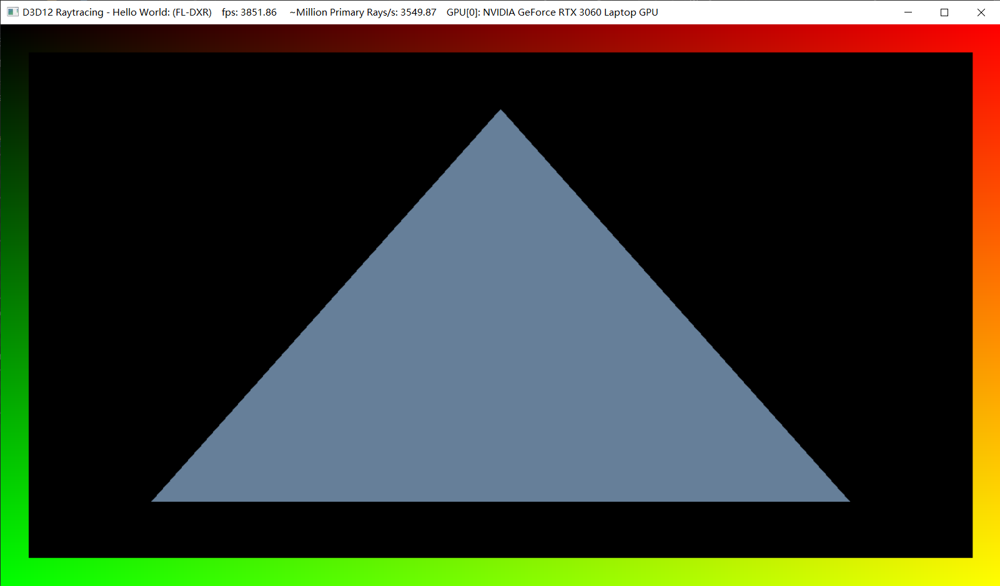

Project 0 Getting Started
====================

**University of Pennsylvania, CIS 565: GPU Programming and Architecture, Project 0**

* Alex Fu
  * [LinkedIn](https://www.linkedin.com/in/alex-fu-b47b67238/)
  * [twitter](https://twitter.com/AlexFu8304)
* Tested on: Windows 10, i7-10750H @ 2.60GHz, 16GB, GTX 3060 6GB

## CUDA

### 1.1 CUDA Compatibility

### 1.2 Nsight Timeline

### 1.3 Nsight Debug

## WebGL

## DXR

### 1.1 FL-DXR Mode

### 1.2 FL Mode

### 1.3 FL Mode

