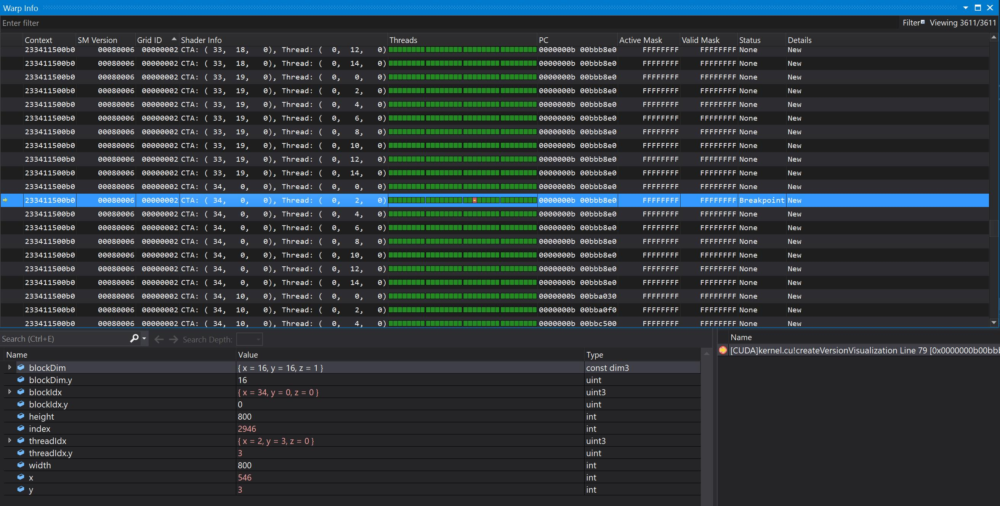

Project 0 Getting Started
====================

**University of Pennsylvania, CIS 565: GPU Programming and Architecture, Project 0**

* Shixuan Fang
  * Linkedin: [https://www.linkedin.com/in/shixuan-fang-4aba78222/]()
* Tested on: Windows 11, i7-12700k, RTX 3080Ti (Personal)

 Submission
 ====================
Compute Capability: 8.6

* Part 3.1.1: Modify the CUDA Project and Take a Screenshot

* Part 3.1.2: Analyze

* Part 3.1.3: Nsight Debugging

* Part 3.2: WebGL

* Part 3.3: DXR

