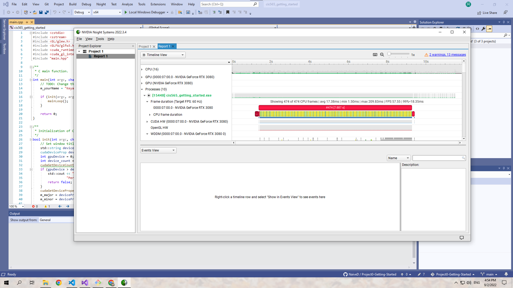

Project 0 Getting Started
====================

**University of Pennsylvania, CIS 565: GPU Programming and Architecture, Project 0**

* Keyan Zhai
  * [LinkedIn](https://www.linkedin.com/in/keyanzhai), [personal website](https://keyanzhai.cool/)
* Tested on: Windows 10 Pro, AMD Ryzen 7 5800X 8-Core Processor 3.80 GHz, RTX 3080 10GB (personal)

<!-- ### README

Include screenshots, analysis, etc. (Remember, this is public, so don't put
anything here that you don't want to share with the world.) -->

---

### Compute Capability of CUDA-compatible GPU

* GPU: GeForce RTX 3080	
* Compute Capability: 8.6

---

### CMake modification

Changed line 97 of `CUDAComputesList.cmake` from

```cmake
FOREACH(VER 20 30 32 35 37 50 52 53 60 61 62 70 72 75 80 86)
```

to

```cmake
FOREACH(VER 32 35 37 50 52 53 60 61 62 70 72 75 80 86)
```

> Reference: <https://edstem.org/us/courses/28083/discussion/1723078>

---

### CUDA


