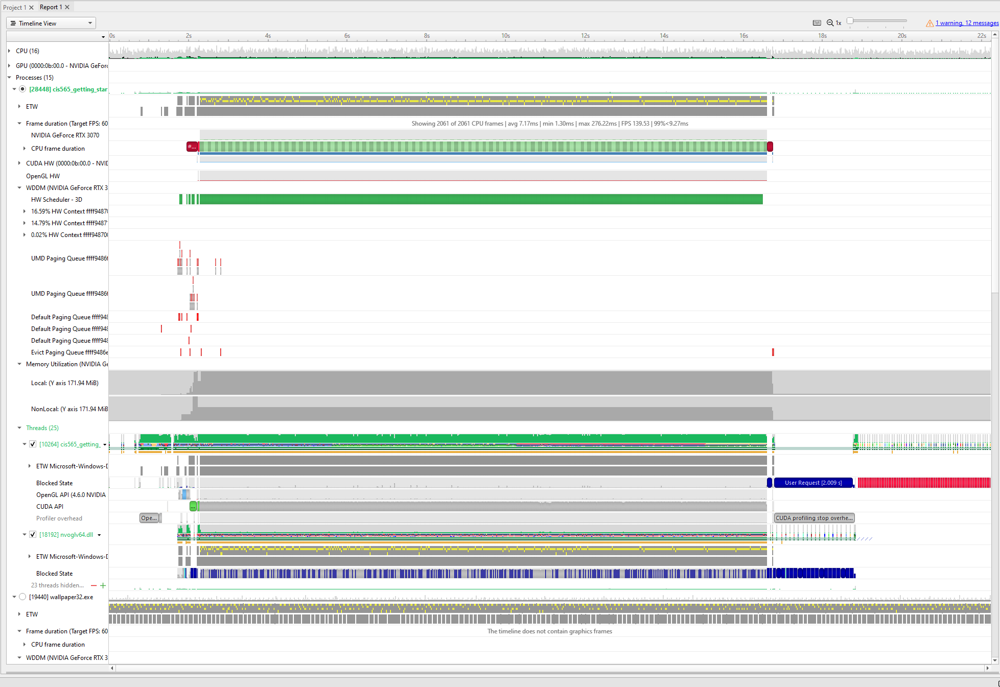

Project 0 Getting Started
====================

**University of Pennsylvania, CIS 565: GPU Programming and Architecture, Project 0**

* Runshi Gu
  * [LinkedIn](https://www.linkedin.com/in/runshi-gu-445648194/)
* Tested on: Windows 10, AMD Ryzen 7 5800X 8-Core Processor @ 3.80 GHz 32GB, RTX3070 24538MB, Personal

### Screenshots

