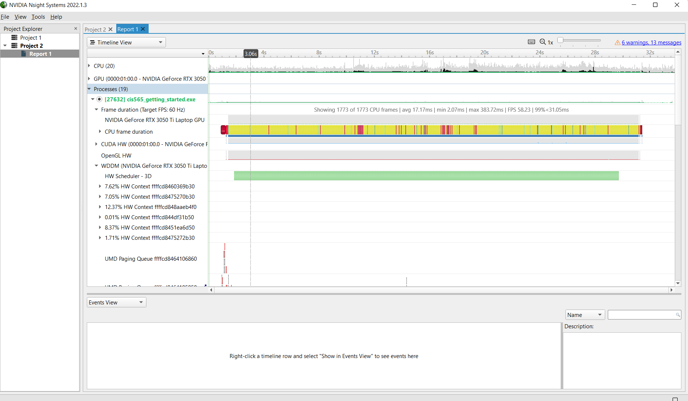
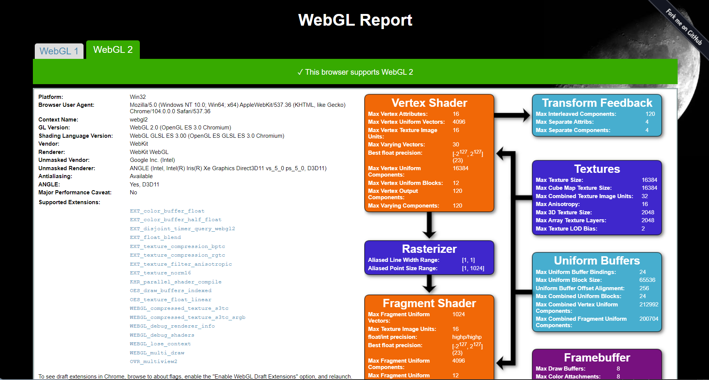

Project 0 Getting Started
====================

**University of Pennsylvania, CIS 565: GPU Programming and Architecture, Project 0**

* DI LU
  * LinkedIn: https://www.linkedin.com/in/di-lu-0503251a2/
* Tested on: Windows 11, i7-12700H @ 2.30GHz 32GB, NVIDIA GeForce RTX 3050 Ti

Project 0 Results
====================
### 1. Modify the CUDA Project and Take a Screenshot

### 2. NVIDIA NSight System Analysis

### 3. Nsight Debugging

### 4. WebGL Results

### 5. DirectX

