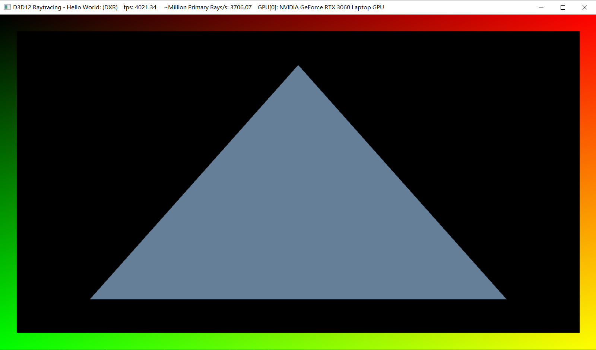

# Project 0 Getting Started
**University of Pennsylvania, CIS 565: GPU Programming and Architecture, Project 0**
- Name: Tongwei Dai
	- [LinkedIn Page](https://www.linkedin.com/in/tongwei-dai-583350177/)
- Tested on: Windows 10, i7-8700 @ 3.20 GHz 16GB, RTX 2070
# Screenshots
## Part 3.1.1 Modified CUDA Project Window

## Part 3.1.2 Nsight Profiling Report

## Part 3.1.3 Nsight Debugging

## Part 3.2 WebGL support

## Part 3.3 DXR support
