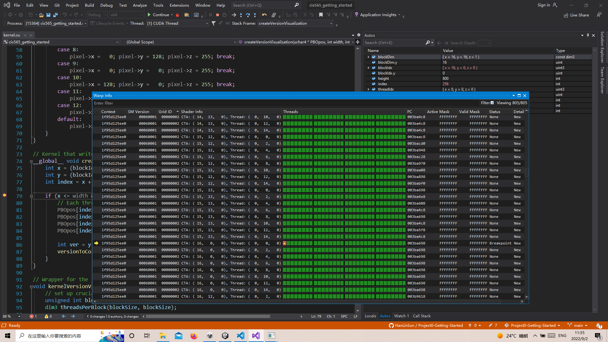

Project 0 Getting Started
====================

**University of Pennsylvania, CIS 565: GPU Programming and Architecture, Project 0**

* Hanlin Sun
  * [LinkedIn](https://www.linkedin.com/in/hanlin-sun-7162941a5/)
  * [personal website](https://hanlinsun.github.io/), 
  * Tested on: Windows 10, i7-8750H @ 2.21GHz 32GB, NVIDIA Quadro P3200
  * My personal computer does not have RTX GPU, so I will use CETS virtual machine instead to finish the Raytracing part.

### README
* GPU : NVIDIA Quadro P3200
* Compute ability: 6.1

#### Nsight Analyse:

#### Nsight Debug:

#### WebGL:

#### DXR Support:

* This part is done by using computers in SIGLAB

Include screenshots, analysis, etc. (Remember, this is public, so don't put
anything here that you don't want to share with the world.)

