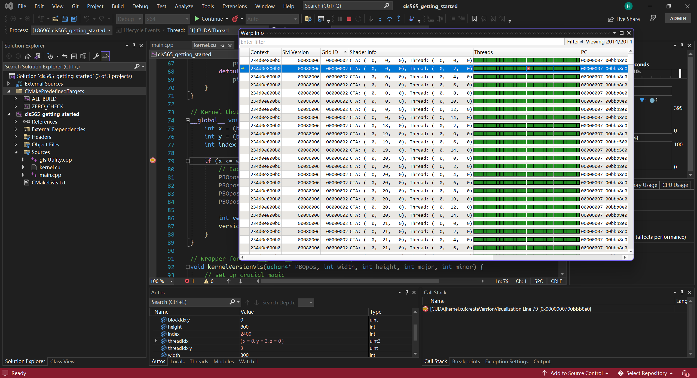

Project 0 Getting Started
====================

**University of Pennsylvania, CIS 565: GPU Programming and Architecture, Project 0**

* Chang Liu
  * [LinkedIn](https://www.linkedin.com/in/chang-liu-0451a6208/), [personal website](https://hummawhite.github.io/)
* Tested on personal laptop:
  - Windows 11
  - i7-12700 @ 4.90GHz with 16GB RAM
  - RTX 3070 Ti Laptop 8GB

### 3.1 CUDA Compatibility

#### 3.1.1 Program

#### 3.1.2 Profiling

#### 3.1.3 Debugging

### 3.2 WebGL Compatibility

### 3.3 DXR Compatibility

All three modes are supported. DXR and FL-DXR exhibit the same performance, about twice as FL.

