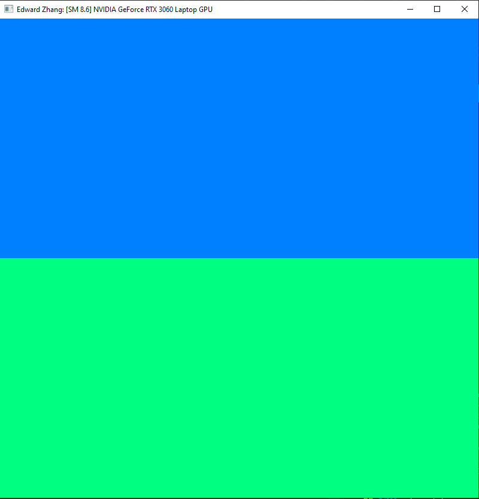

Project 0 Getting Started
====================

**University of Pennsylvania, CIS 565: GPU Programming and Architecture, Project 0**

* Edward Zhang
  * https://www.linkedin.com/in/edwardjczhang/
  * https://zedward23.github.io/personal_Website/
 
* Tested on: Windows 10 Home, i7-11800H @ 2.3GHz, 16.0GB, NVIDIA GeForce RTX 3060 Laptop GPU

### Images

Include screenshots, analysis, etc. (Remember, this is public, so don't put
anything here that you don't want to share with the world.)

