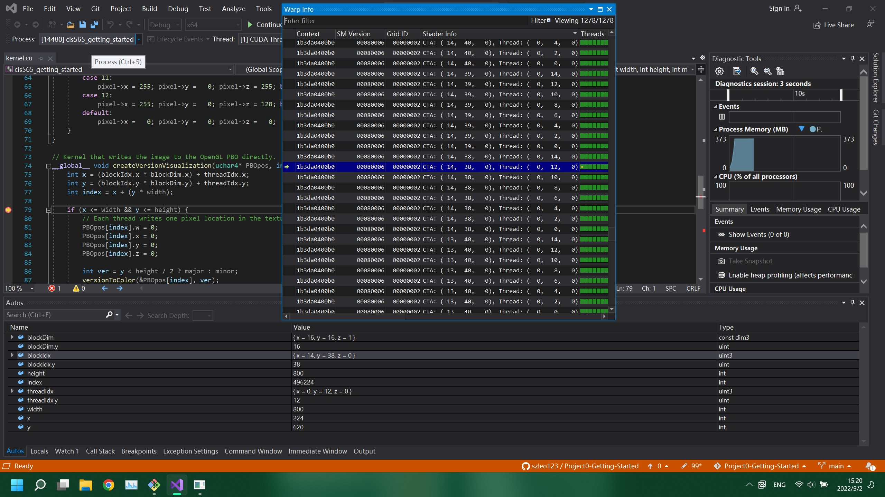

Project 0 Getting Started
====================

**University of Pennsylvania, CIS 565: GPU Programming and Architecture, Project 0**

* Yilin Li
* Tested on: Windows 10, i7-12700H @ 2.30GHz 16GB, NVIDIA RTX 3060  (personal laptop)

## Project Write-up

### Part 3.1: CUDA

The Compute Capability of NVIDIA T1000 is 8.6. 

### Part 3.1.1 

### Part 3.1.2

### Part 3.1.3

### Part 3.2 

### Part 3.3 
The laptop has DXR support but the following error pops out after the expected image appears for half a second. 

> 'Unhandled exception at 0x00007FFA3467474C (KernelBase.dll) in D3D12RaytracingHelloWorld.exe: 0x0000087A (parameters: 0x0000000000000001, 0x0000005DBE6FC280, 0x0000005DBE6FE060).'
