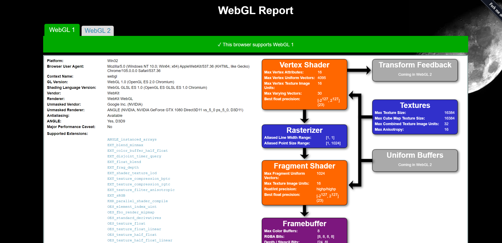

Project 0 Getting Started
====================

**University of Pennsylvania, CIS 565: GPU Programming and Architecture, Project 0**

* Yiyang Chen
  * [LinkedIn](https://www.linkedin.com/in/yiyang-chen-6a7641210/), [personal website](https://cyy0915.github.io/)
* Tested on: Windows 10, i5-8700k @ 3.7GHz, GTX 1080, personal computer

## My Readme
### 3.1
Compute capability of my GPU GTX 1080: 6.1

### 3.1.1

### 3.1.2

### 3.1.3

### 3.2

### 3.3
